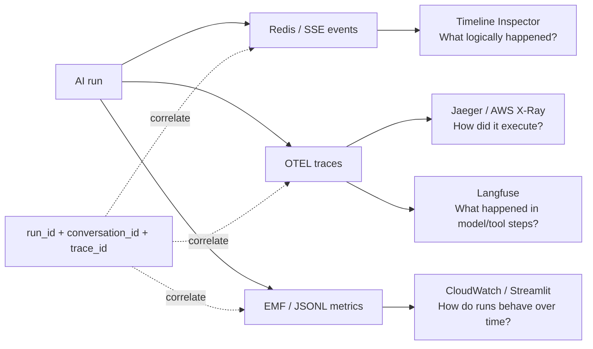
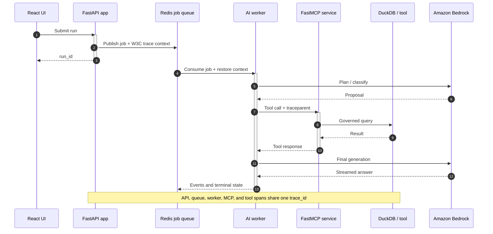
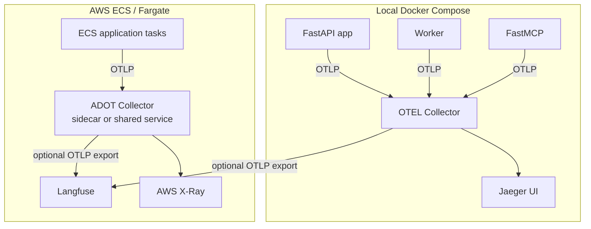

# ADR 0007 — Telemetry, OpenTelemetry, and Comparison Architecture

## Status

Accepted. Amended 2026-09-19 to define the OpenTelemetry (OTEL) tracing architecture and make this ADR the single source of truth for Issue #111.

## Context

The platform now executes an AI run across several independently deployable processes. A submitted run may cross the FastAPI application, a Redis job queue, the worker, the MCP HTTP service, DuckDB, and Bedrock. Upcoming realtime voice and multimodal work adds Transcribe, Polly, cancellation, and streaming stages.

Runs already persist point-in-time telemetry in DynamoDB under `RUN#<run_id>` / `METADATA`. The application also emits semantic lifecycle events through Redis/SSE and aggregate run metrics through CloudWatch Embedded Metric Format (EMF) or a local JSONL file. Those signals answer different questions, but they do not reconstruct one request across process and service boundaries.

We need an observability architecture that:

1. keeps the live analytical loop low-overhead;
2. preserves existing semantic events and aggregate metrics;
3. reconstructs a run across the API, queue, worker, MCP, tool, and model boundaries;
4. keeps instrumentation vendor-neutral;
5. supports operational debugging and AI-native model/tool inspection;
6. avoids exporting prompts, raw SQL, secrets, or unrestricted user content by default; and
7. works in Docker Compose and AWS ECS/Fargate without requiring Kubernetes.

## A simple mental model

Observability begins with a question, not a dashboard or vendor. Different forms of telemetry preserve different kinds of evidence:

| Concept | Plain-language meaning | Example in this application |
| --- | --- | --- |
| Event | A meaningful thing happened | `tool.started`, `answer.delta`, or `run.completed` |
| Span | One operation ran for a period of time | `llm.plan`, `mcp.tool.execute`, or `duckdb.query` |
| Trace | The causally connected story of one request | API acceptance through queue, worker, MCP, and final generation |
| Log | A process reported diagnostic detail at one moment | Worker could not connect to Redis |
| Metric | A numeric summary of many observations | p95 TTFT or failure ratio over the last hour |

A span is useful because it measures one operation. A trace is useful because it nests those spans and preserves their parent/child relationships. A metric deliberately loses per-request detail so thousands of runs can be compared cheaply. A log supplies local diagnostic detail. A semantic event describes product behavior that a generic HTTP span cannot express.

The architecture keeps these signals separate because making one signal serve every purpose produces a worse result: traces are expensive to aggregate, metrics cannot reconstruct one request, logs do not reliably preserve causality, and product events should not be overloaded with infrastructure detail.

## A troubleshooting story

Suppose a user says, “My taxi analysis took twelve seconds.” The application gives us a `run_id`.

The Timeline Inspector first shows what the user experienced: the run was received, planning started, a tool ran, context was reduced, and the final answer completed. That confirms the workflow progressed, but it does not explain why it was slow.

The same `run_id` maps to an OTEL `trace_id`. Opening that trace shows that the API accepted the request quickly, the job waited six seconds in Redis, the worker spent one second in Bedrock planning, MCP and DuckDB finished in half a second, and final generation took two seconds. The trace turns “the AI was slow” into the more precise conclusion “the job waited for a worker.”

Dashboard metrics then answer whether this was an isolated request or a system trend. If queue-wait p95 rose for every run while model and tool latency stayed flat, the operator investigates worker capacity. If only this trace was slow, the operator inspects its correlated worker logs. If model tokens or ReAct steps grew, Langfuse provides the AI-native hierarchy needed to understand that behavior.

This story explains the choices in this ADR:

- stable IDs connect the views without forcing all data into one backend;
- explicit AI spans make the trace meaningful rather than merely showing HTTP calls;
- queue context propagation preserves causality across asynchronous work;
- aggregate EMF metrics distinguish a one-off incident from fleet behavior;
- Langfuse specializes in model/tool reasoning while AWS tools specialize in operations; and
- the Collector keeps routing and backend credentials outside business logic.

The desired outcome is not “more telemetry.” It is a short path from a user symptom to a defensible engineering conclusion.

## Decision summary

The four observability views remain distinct and correlate through stable identifiers.



OpenTelemetry is the instrumentation and propagation standard. It is additive to the current event, logging, and metrics paths.

## Decisions

### 1. Preserve signal ownership

| Signal | Primary question | Initial destination |
| --- | --- | --- |
| Redis/SSE semantic events | What logically happened during this run? | Timeline Inspector |
| OTEL distributed traces | How did this request execute across components? | Jaeger locally; AWS X-Ray operationally |
| AI-relevant OTEL spans | What happened in model, tool, and agent steps? | Langfuse |
| Aggregate run metrics | How does the population of runs behave over time? | CloudWatch EMF; local JSONL + Streamlit/DuckDB |
| Application logs | What diagnostic event did a process report? | Structured `stdout`; CloudWatch Logs in AWS |
| Durable run metadata | What is the authoritative saved state of this run? | DynamoDB |

A semantic event such as `tool.completed` contains workflow meaning that a generic HTTP span does not. A trace reconstructs causality better than a flat event list. Metrics aggregate cheaply across many runs. Langfuse optimizes individual AI execution inspection rather than fleet health. None replaces the others.

### 2. CloudWatch EMF remains the aggregate metrics path

Production writes structured EMF JSON to `stdout`. ECS/CloudWatch Logs ingests it asynchronously into CloudWatch Metrics. Local development may append compatible run summaries to `metrics/runs.jsonl`, which the Streamlit/DuckDB comparison workflow can query.

The first OTEL milestone will not duplicate these measurements through an OTEL metrics pipeline merely because OTEL supports metrics. Existing run-level measurements remain authoritative for population analysis:

```text
run_id
conversation_id
milestone
model
turn_type / strategy
status
end_to_end_latency
proposal_llm_latency
tool_latency
final_answer_llm_latency
TTFT
input_tokens
output_tokens
estimated_cost
started_at
completed_at
```

DynamoDB remains authoritative for durable run metadata. A GSI may support efficient cross-run lookup without table scans, but DynamoDB is not a tracing backend.

### 3. OTEL provides distributed tracing

The application, worker, and MCP services will use the OpenTelemetry API and SDK and export traces with OTLP. Standard W3C Trace Context must cross every asynchronous and HTTP boundary.

Automatic instrumentation supplies transport spans and common propagation for supported frameworks. Explicit manual spans define the meaningful AI stages. Auto-instrumentation does not replace semantic spans such as `llm.plan`, `mcp.tool.execute`, or `llm.generate`.



The Redis job envelope must carry trace context. The worker must restore that context before creating spans; otherwise it would start an unrelated root trace. The MCP client injects W3C context into the HTTP request, and the MCP server continues the incoming trace.

A representative trace is:

```text
ai.run
├─ request.accept
├─ job.publish
└─ job.consume
   ├─ conversation.resolve
   ├─ context.schema.load
   ├─ llm.plan
   ├─ mcp.tool.execute
   │  └─ HTTP MCP server
   │     └─ duckdb.query
   ├─ context.reduce
   └─ llm.generate
```

### 4. Run a Collector adjacent to the services

The OTEL SDKs create spans inside the Python processes. An adjacent OpenTelemetry Collector receives, batches, processes, and routes those spans. The Collector does not invent the application-specific spans.



For local development, one shared Collector service is added to Docker Compose. Jaeger provides a lightweight local trace UI. `docker-compose.aws.yml` continues to supply real AWS credentials and configuration for Bedrock, DynamoDB, Transcribe, and Polly; OTEL is independent of whether those dependencies are local or remote.

For AWS, use AWS Distro for OpenTelemetry (ADOT) in ECS/Fargate as either a sidecar or a shared Collector service. Choose between those deployment forms when the ECS topology is implemented. Kubernetes manifests are a non-goal because this project deploys to ECS/Fargate.

Tracing must be optional and fail-open: disabling the exporter or losing the Collector must not change request behavior or make the application unavailable.

### 5. Langfuse is a backend, not the instrumentation contract

Export AI-relevant OTEL traces to Langfuse for model, tool, ReAct/agent, token, cost, and future evaluation inspection. Core orchestration code must not depend on Langfuse-specific APIs when OTEL can represent the same trace model.

Jaeger or AWS X-Ray remains the operational distributed-tracing view. CloudWatch remains the fleet metrics and service-health authority.

### 6. Logs remain structured `stdout`

The first OTEL milestone does not require moving application logs into an OTEL logging pipeline. Existing structured logs continue to go to `stdout` and CloudWatch Logs. When a log is emitted inside an active span, logging configuration should include `trace_id` and `span_id` so engineers can move between a log record and its trace.

OTEL log export may be evaluated later, but it must not create a second competing logging contract.

### 7. Minimum AI telemetry contract

Major AI, model, and tool spans use OpenTelemetry GenAI semantic conventions where applicable and share a safe project vocabulary.

| Attribute | Applies to | Notes |
| --- | --- | --- |
| `ai.run_id` | Root and major child spans | Correlates with durable run state and events |
| `ai.conversation_id` | Root and relevant child spans | Stable application identifier |
| `ai.milestone` | Root span | Release/learning milestone |
| `ai.turn_type` / strategy | Root and planning spans | Text, voice, ReAct, or other bounded strategy |
| `ai.step_index` | Iterative spans | Bounded loop step |
| `gen_ai.request.model` | Model spans | Requested model identifier |
| input/output token counts | Model spans | Use semantic-convention names where available |
| duration | Major spans | Prefer native span duration; mirror only when needed |
| estimated cost | Model or run spans | Bounded numeric estimate |
| tool name | Tool spans | Stable tool identifier, not raw arguments |
| status/error | All relevant spans | Record exceptions on the span that failed |

Do not attach raw prompts, unrestricted user content, secrets, AWS credentials, raw SQL, complete tool arguments, or unbounded model output to span attributes by default.

### 8. Correlation model

Carry these identifiers together where practical:

```text
run_id
conversation_id
trace_id
```

Existing semantic events may include `trace_id`, allowing the Timeline Inspector to link a run to its distributed trace. High-cardinality identifiers belong in trace attributes and logs, not CloudWatch metric dimensions.

## Question → authoritative view

| Question | Best place |
| --- | --- |
| What logically happened during this run? | Redis/SSE Timeline Inspector |
| How did one request cross API → queue → worker → MCP → DuckDB? | OTEL distributed trace |
| Why is the API, worker, or MCP service failing? | AWS operational monitoring, logs, and OTEL |
| What happened inside a ReAct/model/tool execution? | Langfuse |
| Which model or tool step was slow or expensive? | Langfuse and the OTEL trace |
| Why is p95 latency rising across requests? | CloudWatch Metrics |
| How do models compare across a benchmark set? | Streamlit/DuckDB or CloudWatch |
| Did answer quality regress? | Langfuse or a future evaluation layer |
| Is the service unhealthy? | AWS operational monitoring |

## Metrics question guide

### Voice latency

- end-of-speech to STT final;
- tool execution;
- LLM time to first token;
- TTS time to first audio; and
- total turn latency.

### Barge-in and cancellation

- time from detected speech to audio halt;
- LLM cancellation latency; and
- avoided tokens or audio after interruption.

### Model comparison

- p50, p90, and p95 latency;
- TTFT;
- token usage;
- estimated cost; and
- quality/evaluation signals.

### Cascaded voice versus native speech-to-speech

- conversational latency;
- tool-call reliability;
- observability and auditability; and
- cost per conversational minute.

## Implementation acceptance criteria

- [ ] The app, worker, and MCP services initialize OTEL tracing and can export through OTLP.
- [ ] One submitted run creates a root `ai.run` trace with meaningful semantic child spans.
- [ ] W3C trace context propagates through the Redis job envelope from API to worker.
- [ ] W3C trace context propagates from the worker/app client to MCP over HTTP.
- [ ] MCP and DuckDB/tool execution continue the same trace instead of creating unrelated roots.
- [ ] `run_id`, `conversation_id`, and `trace_id` can be correlated.
- [ ] Major AI/model/tool spans implement the safe minimum telemetry contract.
- [ ] Exceptions and failure status appear on the span that failed.
- [ ] Tracing can be disabled or unavailable without changing request behavior.
- [ ] Raw prompts, raw SQL, secrets, and unrestricted user content are not exported by default.
- [ ] Local traces are inspectable in Jaeger.
- [ ] AI-relevant traces are inspectable in Langfuse without proprietary core instrumentation.
- [ ] Tests prove queue and HTTP cross-service trace propagation.
- [ ] Continued request traffic with missing expected root or MCP child spans is detectable.
- [ ] Existing Redis/SSE events, CloudWatch EMF, JSONL, Streamlit/DuckDB, and DynamoDB paths remain intact.

## Non-goals

- replacing Redis/SSE lifecycle events;
- replacing CloudWatch EMF or local comparison metrics;
- replacing structured application logs;
- replacing AWS operational monitoring with Langfuse;
- coupling core orchestration directly to a proprietary tracing backend;
- introducing Kubernetes, Prometheus, Grafana, Kafka/Kinesis, OpenSearch, or another database for this milestone;
- adding answer-quality scoring frameworks in the tracing milestone; or
- exporting high-cardinality or raw user content as metric dimensions.

## Consequences

- Semantic lifecycle events, distributed traces, AI-native inspection, logs, and aggregate metrics remain distinct but correlated.
- Instrumentation stays portable through OTEL APIs, W3C Trace Context, and OTLP.
- Local Compose gains Collector and Jaeger services; production ECS gains an ADOT deployment decision and associated resource overhead.
- Queue propagation becomes as important as HTTP propagation.
- The production React UI remains an analytical control room rather than becoming a developer observability console.
- Operators can change trace backends without rewriting semantic span instrumentation.

## References

- [Day-2 Observability Dashboard Side Project](../research/observability/day2-observability-dashboards.md)
- [OpenTelemetry Python instrumentation](https://opentelemetry.io/docs/languages/python/instrumentation/)
- [OpenTelemetry Collector quick start](https://opentelemetry.io/docs/collector/quick-start/)
- [AWS Distro for OpenTelemetry on ECS](https://aws-otel.github.io/docs/setup/ecs/)
- [Issue #111](https://github.com/NakulManchanda/ai-analytics-poc/issues/111)
