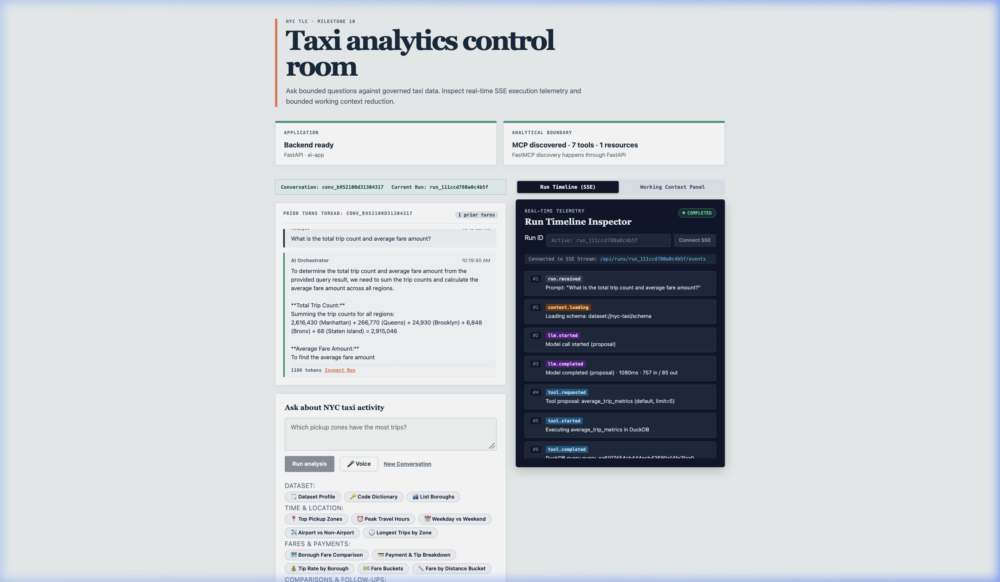
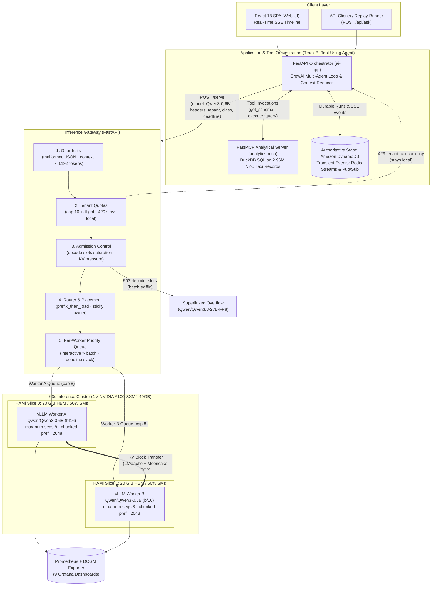

# Inference Cluster & Serving Architecture — Track B Submission

**Repository:** [GitHub: NakulManchanda/ai-analytics-poc](https://github.com/NakulManchanda/ai-analytics-poc)  
**Submission Track:** **Track B — Tool-Using Agent** (CrewAI Multi-Agent Strategy + FastMCP DuckDB Tools)  
**Canonical Design Doc:** [DESIGN.md](../DESIGN.md)  
**Evidence Artifacts:** [docs/inference-experiments/evidence/](inference-experiments/evidence/) (7 plots, 11 curated metric summaries, executed notebook)



*The Taxi Analytics Control Room UI: the copilot calls FastMCP DuckDB tools (`average_trip_metrics`, `read_schema`) over millions of NYC taxi rows, and answers with structured figures alongside the real-time SSE execution inspector.*

---

## Part 0. The Application & Serving Architecture (Track B)

Our application is an enterprise analytics copilot over the NYC Yellow Taxi dataset (millions of trip records in Parquet tables).
- **Workload Loop:** Multi-step agent loop (`think` → `tool call` → `observe` → `answer`).
- **Framework & Tools:** Powered by **CrewAI** (`Researcher` + `Writer` agents) and standard iterative tool loops interacting with an independent **FastMCP** server running SQL analytics in DuckDB.
- **Prefix & Token Structure:**
  - **Shared Prefix:** Global system instructions + tool JSON schemas (**223 exact tokens**, cached across all sessions).
  - **Lengthening Pre-fill:** Each conversation turn appends tool observations and agent reasoning tokens, creating lengthening prefills across successive turns.
  - **Traffic Mix:** Interactive user queries (`tenant_interactive`), synthetic noisy agent loops (`tenant_noisy`), and background evaluation/sweeps (`tenant_batch`).

### Architecture Decisions

| Part | Decision | Why |
| :--- | :--- | :--- |
| **Northbound** | Gateway `/serve` + FastMCP DuckDB | Application owns tool execution and conversation state; gateway owns GPU entry |
| **Guard** | Structural JSON & context check (> 8,192 tokens) | Rejects bad payloads (400/413) at the door before consuming GPU compute |
| **Tenant Quota** | Concurrency cap (`TENANT_MAX_CONCURRENCY=10`) + token budget | Stops single noisy tenant from monopolizing GPU slots; 429 strictly stays local |
| **Admission** | Decode slots saturation (`MAX_DECODE_SLOTS=8`) + KV pressure check | Protects GPU decode slots from overload; sheds early to preserve interactive tail latency |
| **Router** | `prefix_then_load` with sticky owner and queue depth anti-herding | Maximizes prefix cache hit rate (72%-98%) while preventing burst congestion on one replica |
| **Queue** | Class-aware per-worker priority queue (interactive over batch) | Prevents background analytics sweeps from head-of-line blocking interactive turns on the target worker |
| **Cache** | Local vLLM prefix cache + LMCache/Mooncake TCP store | 3.1x TTFT speedup on turn 1; enables inter-worker KV block reuse |
| **Engine** | vLLM (v0.11.0) serving Qwen/Qwen3-0.6B (bf16) | Native PagedAttention, continuous batching, and chunked prefill at 2,048 tokens |
| **Device / Pod** | HAMi GPU slicing (two 20 GiB / 50% SM slices on 1 A100-40GB) | Isolates two worker pods with dedicated KV pools on one physical GPU |
| **Overflow** | Superlinked hosted `Qwen/Qwen3.8-27B-FP8` | Offloads shed batch requests (503) to external sibling model, rescuing batch traffic |
| **Scaling** | Scale decode slots pool (not KV memory) | E0 proved decode slots are the primary bottleneck, while KV cache stays cold (<46%) |

### Architecture Diagram



### How One Request Flows

1. **Client / App Interaction:** The client sends an analytics question (`/api/ask`) or starts a multi-step CrewAI run. The orchestrator calls the local FastMCP server for DuckDB SQL tools, then dispatches the prompt to `http://127.0.0.1:18080/serve` with tenant and deadline headers.
2. **Guard:** [`gateway/guard.py`](../infra/inference/gateway/guard.py) checks JSON structure and context length. Payloads exceeding 8,192 tokens or with malformed schemas are rejected immediately with `400` or `413` without consuming GPU cycles.
3. **Tenant Quota:** [`gateway/tenants.py`](../infra/inference/gateway/tenants.py) tracks in-flight requests per tenant. If a tenant exceeds 10 concurrent requests, it is throttled with `429 tenant_concurrency` (which strictly stays local and never overflows).
4. **Admission Control:** [`gateway/admission.py`](../infra/inference/gateway/admission.py) checks cluster decode slots and worker free KV. If local decode slots are saturated, batch requests are routed to the capacity overflow handler; otherwise, shed with `503 decode_slots`.
5. **Router & Placement:** [`gateway/placement.py`](../infra/inference/gateway/placement.py) evaluates prefix affinity (`prefix_then_load`) and worker queue depth. It assigns the sticky owner worker holding the cached prefix (223-token system + tool schemas), falling back to least-loaded. If batch slots on the candidate worker are full (cap 6 of 8 slots), it sheds with `503 batch_slot_cap`.
6. **Per-Worker Priority Queue:** [`gateway/queueing.py`](../infra/inference/gateway/queueing.py) acquires an execution slot in the chosen worker's queue, ordering admitted requests by traffic class (interactive before batch), prompt length, and deadline slack. Discards requests with `504 timeout_queue` if deadline expires before an in-flight slot opens.
7. **Engine Execution:** Dispatched to the chosen vLLM worker (`ClusterIP:8000`). vLLM executes chunked prefill (2,048 tokens) and decodes with continuous batching. Streams back through the gateway to the orchestrator.

---


## Part 1. Capacity on Paper

### The Formula
```math
\text{max\_concurrent\_seqs} \approx \frac{\text{HBM} - \text{weights} - \text{activations}}{\text{kv\_bytes\_per\_token} \times \text{max\_len}}
```

### Parameters & Math for Qwen3-0.6B on our 20 GiB GPU Slice:
- **GPU Slice:** 1 x NVIDIA A100-SXM4-40GB sliced via HAMi to **20 GiB HBM** (50% memory and core slice).
- **Model Architecture:** Qwen/Qwen3-0.6B, bfloat16, 28 layers, 8 KV heads, head dimension 128.
- **Weights:** $\approx$ 1.12 GiB.
- **KV Bytes per Token:**
```math
\text{kv\_bytes\_per\_token} = 2 \times \text{layers} \times \text{kv\_heads} \times \text{head\_dim} \times \text{bytes\_per\_elem}
```
```math
= 2 \times 28 \times 8 \times 128 \times 2 = 114,688\text{ bytes (112 KiB)}
```
- **KV Pool per Worker:**
  - With `--max-num-batched-tokens 8192`: 7.61 GiB = **71,200 tokens** (4,450 blocks $\times$ 16).
  - With `--max-num-batched-tokens 2048`: 7.78 GiB = **72,736 tokens** (4,546 blocks $\times$ 16). Lowering batched tokens reduces peak activation memory allocated during warmup profiling, freeing $\approx$ 175 MiB (~96 blocks) for the KV pool.
- **Calculated Concurrency:**
  - At `max_len` (8,192 tokens): $71,200 / 8,192 =$ **8.69** concurrent sequences (or **8.88** with 72,736 pool).
  - At app actual lengths (p50 $\approx$ 541 tokens, max $\approx$ 984 tokens): $\approx$ **130 – 134** sequences at p50; $\approx$ **71 – 73** sequences at max length.

### Model Switch Comparison Table (Paper Math on 20 GiB Slice):

| Configuration | Model Params | Precision (weights / KV) | KV Bytes / Token | Est. Weights | Est. KV Budget | Est. KV Pool (tokens) | Concurrency at max_len (8,192) |
|---|---|---|---|---|---|---|---|
| **Qwen3-0.6B (current)** | 0.6B (28L, 8KV, D128) | bf16 / bf16 | 114,688 (112 KiB) | 1.12 GiB | 7.61 GiB | 71,200 – 72,736 | **8.69 – 8.88** |
| **Qwen3-0.6B (FP8 KV)** | 0.6B (28L, 8KV, D128) | bf16 / fp8 | 57,344 (56 KiB) | 1.12 GiB | ~7.61 GiB | ~142,400 | **17.38** |
| **Qwen2.5-7B (bf16)** | 7.6B (28L, 4KV, D128) | bf16 / bf16 | 57,344 (56 KiB) | ~14.2 GiB | ~3.8 GiB | ~70,000 | **8.54** |
| **Qwen2.5-7B (FP8 KV)** | 7.6B (28L, 4KV, D128) | bf16 / fp8 | 28,672 (28 KiB) | ~14.2 GiB | ~3.8 GiB | ~140,000 | **17.08** |

### Expected vs. Measured Limiter:
- **Hypothesis:** Expected KV cache memory to saturate first.
- **Observed Reality (E0):** **Hypothesis was wrong.** The **8-slot scheduler cap (`--max-num-seqs 8`)** ran out first at every context length. KV cache peaked at only 46% under direct overload and 3% during the gateway sweep.

---

## Part 2. Design the Cluster

- **GPU:** 1 x NVIDIA A100-SXM4-40GB on Lambda Cloud. Why: Sufficient HBM to host two isolated 20 GiB slices with independent vLLM workers and dedicated KV pools.
- **Model:** `Qwen/Qwen3-0.6B` (bf16). Compact weights allow generous KV headroom, and Hermes-compatible tool calling executes SQL generation reliably.
- **Topology:** Two colocated replicas on 1 GPU sliced 50/50 via **HAMi** (memory and core slicing).
- **Concurrency & Context:** `--max-num-seqs 8`, `--max-model-len 8192`, `--gpu-memory-utilization 0.45`, `--max-num-batched-tokens 2048`.
- **Hop Backend:** LMCache with Mooncake over TCP (`infra/inference/kv_transfer/`, `infra/inference/mooncake/`).
- **Overflow Destination:** Superlinked hosted OpenAI-compatible endpoint serving `Qwen/Qwen3.8-27B-FP8`. Sibling model architecture ensures tool schemas, prompt formatting, and system prompts transfer without conversion errors.
- **Box Separation:**
  - **Gateway Box (`infra/inference/gateway/`):** FastAPI orchestrator owning guard, admission, placement, queueing, and overflow. Never loads a model.
  - **Engine Box (`infra/inference/k8s/workers/`):** vLLM v0.11.0 owning prefill/decode kernels, PagedAttention block table, continuous batching, and preemptions.
- **Scaling Pool:** If scaling, scale the **decode slots pool**. E0 proved decode slots are hot while KV is cold. (Adding identical colocated replicas on the same GPU duplicates weights without adding compute).

---

## Part 3. Guardrails, Admit, Stay vs. Leave

### Implementation Locations:
- **Guard:** [`infra/inference/gateway/guard.py`](../infra/inference/gateway/guard.py) (`inspect(payload) -> GuardDecision`)
  - First "no": Rejects malformed JSON payloads (HTTP 400 `malformed_payload`), missing messages (HTTP 400), prompt length > 8,192 tokens (HTTP 413 `prompt_too_long`), and context window breaches (HTTP 413 `context_window_exceeded`). Never touches GPU.
- **Admission:** [`infra/inference/gateway/admission.py`](../infra/inference/gateway/admission.py) (`should_admit(req, snap) -> (admit?, code, reason, retry_after)`)
  - Evaluates worker capacity: sheds on `no_signal` (503), `kv_pressure` (< 10% free KV, 503), `decode_slots` (local slots full, 503), and `deadline_unachievable` (504).
- **Tenant Quotas:** [`infra/inference/gateway/tenants.py`](../infra/inference/gateway/tenants.py) (`TENANT_MAX_CONCURRENCY=10`, token budget 200k/window).
- **Stay vs. Leave Policy:**
  - **Stay Local:** HTTP `429` (`tenant_concurrency`, `tenant_tokens`), HTTP `500` (internal bugs), and `slice_oom` **never leave**.
  - **May Leave to Overflow:** Only HTTP `503` or `529` explicitly citing capacity exhaustion (`decode_slots`, `kv_pressure`, `no_signal`) may leave to Superlinked.

### E4 Evidence Deep Dive: Does Admission Protect Interactive Traffic, or Is It Too Aggressive?

In the benchmark run ([`notebook-run-2026-10-10.html`](inference-experiments/evidence/notebook/notebook-run-2026-10-10.html), [`e4-compare-d123-20261010-e4-0003.json`](inference-experiments/evidence/metrics/e4-compare-d123-20261010-e4-0003.json), and [`e4-analysis-d123-20261010-e4-0003.txt`](inference-experiments/evidence/metrics/e4-analysis-d123-20261010-e4-0003.txt)), we evaluated an overload trace of 48 requests across 22 concurrent conversations (12 `tenant_interactive`, 24 `tenant_noisy`, 12 `tenant_batch` with interactive deadlines of 1,500–2,000 ms) under two arms: **Admission OFF** vs. **Admission ON**.

#### Head-to-Head Comparison:

| Metric | Admission OFF (`a_admission_off`) | Admission ON (`b_admission_on`) | Delta / Trade-off |
| :--- | :--- | :--- | :--- |
| **Completed Turns** | **32 of 48** (66.7%) | **20 of 48** (41.7%) | **-12 completed (-37.5%)** |
| **`tenant_interactive` Completed** | **12 of 12 (100%)** | **8 of 12 (66.7%)** | **4 interactive turns shed at door** |
| **`tenant_noisy` Completed** | **20 of 24 (83.3%)** | **12 of 24 (50.0%)** | 8 noisy turns shed at door |
| **`tenant_batch` Completed** | **0 of 12 (0%)** | **0 of 12 (0%)** | Starved in both arms |
| **Rejections & Sheds** | 12 x `batch_slot_cap` (place)<br/>4 x `tenant_concurrency` (quota) | 24 x `decode_slots` (admit)<br/>4 x `tenant_concurrency` (quota) | **58.3% total shed rate in ON** (28/48 failed) |
| **`tenant_interactive` TTFT p95 / p99** | 1,048 ms / 1,435 ms | **638 ms / 638 ms** | -410 ms p95 (-39.1%) |
| **`tenant_interactive` E2E p95 / p99** | 1,857 ms / 2,126 ms | **1,568 ms / 1,568 ms** | -289 ms p95 (-15.6%) |
| **`tenant_interactive` Queue Wait p95**| 540 ms | **0.0 ms** | Eliminated wait for admitted survivors |
| **Engine State (`vLLM Waiting`)** | Max 0 (engine wait ~23 µs) | Max 0 (engine wait ~23 µs) | Engine was never overloaded in either arm |

#### Drilling into the Result: Why Admission ON Was Too Aggressive

1. **Trading Completed Work for Unnecessary Tail Latency Reduction:**
   - In Admission OFF, **all 12 interactive requests completed successfully within client deadlines** (interactive deadline was 1,500–2,000 ms; p95 E2E was 1,857 ms). The gateway queue comfortably absorbed the burst (interactive queue wait p95 was only 540 ms, and overall queue wait p95 was 1,215 ms).
   - In Admission ON, the gateway shed 4 of the 12 interactive requests with HTTP 503 `decode_slots`. While the surviving 8 requests enjoyed tighter tail latency (TTFT p95 dropped from 1,048 ms to 638 ms, and queue wait dropped to 0 ms), this bought latency reduction at the unacceptable cost of **dropping 33% of legitimate interactive user requests** at the door.
2. **Global Decode Slot Counting Without Per-Tenant Isolation:**
   - Admission checks global decode slot saturation (`MAX_DECODE_SLOTS=8` per worker = 16 total cluster-wide).
   - Although admission shedding is class-aware (shedding `batch` before `interactive`), it is not tenant-isolated. A 22-wide concurrency burst driven largely by `tenant_noisy` quickly saturated the 16 global slots. Subsequent requests from `tenant_interactive` were dropped with `decode_slots` despite having clean per-tenant quotas.
3. **Lack of Deadline Slack Before Shedding:**
   - Admission evaluated slot fullness as an instantaneous binary decision rather than calculating whether an incoming request had sufficient slack time to queue. Because the actual queue delay was only ~540 ms in OFF, those 4 shed requests would have easily succeeded in time.

#### Architectural Lessons & Production Remedies:
- **Introduce Queue Slack Before Shedding:** Do not reject immediately upon instantaneous slot saturation. If `estimated_queue_wait + estimated_decode_time < remaining_deadline`, admit the request into the priority queue; shed only when `deadline_unachievable` (504) or queue buffer overflows.
- **Tenant-Reserved Interactive Capacity:** Reserve a baseline quota of decode slots per tenant so noisy neighbors cannot trigger decode-slot starvation for interactive users.
- **Superlinked Overflow Path:** The 24 shed requests (especially the 12 batch analytics turns) demonstrate why external overflow is vital: routing shed batch traffic to the Superlinked endpoint (`Qwen/Qwen3.8-27B-FP8`) fulfills the workload without degrading local GPU tail latency.

---

## Part 4. Placement (Which Worker & Policy)

### Implementation Location:
- [`infra/inference/gateway/placement.py`](../infra/inference/gateway/placement.py) (`pick_worker(req, workers, *, policy) -> Worker | Shed`)

### Policies Supported:
1. `least_loaded`: Evaluates active in-flight count and queue depth; picks least congested worker.
2. `p2c` (Power of Two Choices): Selects two random healthy workers and picks the less congested one.
3. `prefix_then_load` (Default):
   - Scores workers by matching prefix cache tokens.
   - Routes to the worker holding the prefix unless that worker is saturated, unhealthy, or cold.
   - Uses sticky conversation ownership to prevent thrashing between workers.
   - Queue depth acts as an active scorer (anti-herding) so prefix affinity does not catastrophically overload one worker.

---

## Part 5. Queue & Engine (What Runs Next & What You Do Not)

### 1. Who sits in your queue vs vLLM's waiting queue?
- **Gateway Queue:** Requests wait in `infra/inference/gateway/queueing.py` per worker, ordered by class (interactive before batch), prompt length, slack time, and arrival age.
- **vLLM's Waiting Queue:** Because `WORKER_MAX_INFLIGHT=8` matches vLLM's `--max-num-seqs 8`, **vLLM's macro-level waiting queue stays at 0**. The gateway absorbs arrival bursts.
- **Evidence:** `vllm:num_requests_waiting` peaked at `0` in E4 Prometheus scrapes.

#### Crucial Nuance: Why vLLM Can Still Queue Internally Even When Limits Match
While the gateway absorbs macro-level queues (seconds), the engine can and does still queue requests internally under realistic workloads:
1. **Token Budget & Chunked Prefill (`--max-num-batched-tokens 2048`):** Concurrency is two-dimensional (sequences $\times$ tokens). Even when in-flight sequences are $\le 8$, if total prompt/generation tokens across active requests exceed the 2,048-token batch budget in an iteration forward pass, vLLM's continuous batching scheduler chunks prefills and retains admitted requests in the engine's internal `waiting` state until token budget opens up.
2. **Iteration Step Boundaries & Async LLM Engine Scheduling:** In `AsyncLLMEngine`, requests arrive over HTTP asynchronously between forward passes. A request dispatched by the gateway sits in the engine queue (measured at ~23 microseconds in E4) waiting for the current GPU forward pass to complete before the engine's `_schedule()` cycle promotes it from `waiting` to `running`.
3. **Dynamic KV Allocation & Step Latency:** As active sequences generate new tokens, dynamic KV block allocation can pause newly admitted sequences across step boundaries until blocks are freed or paged.
4. **Prometheus Scrape Interval Aliasing:** Prometheus scrapes every 15 seconds. Sub-millisecond or sub-second engine waiting states are smoothed out or missed in gauge snapshots, which gives the appearance of a strictly zero queue in scraped metrics even when transient engine-level scheduling queues occur.

### 2. Waiting / running / swapped (or preempted)?
- Waiting: Gateway priority queues hold waiting requests.
- Running: Capped at 8 per worker (16 cluster-wide).
- Swapped/Preempted: **0 preemptions across all tests.**

### 3. `orch_replica_queue_depth` — which pod, under which mix?
- Gauge `orch_replica_queue_depth{worker, class}`. Balanced under `least_loaded`; skews to the affinity worker during bursts under `prefix_then_load` (E3).

### 4. If a 32k RAG retrieve and a short agent decode are both ready, who goes first?
- **Gateway Decides:** Gateway queue prioritizes interactive agent decodes over long background retrieves.
- **Guard Rejection:** A 32k request is rejected at the door by `gateway/guard.py` (HTTP 413) because the engine context window is 8,192 tokens.

### 5. PagedAttention vs Prefix Cache: which saved memory on your shared-prefix mix?
- **PagedAttention** packed non-contiguous physical blocks (saved memory allocation overhead).
- **Prefix Caching** saved **prefill compute**, not memory (HBM remains flat preallocated). Hit rates reached 72%–98% on the 223-token shared system prefix.

### 6. Chunked prefill & continuous batching: engine flags used and why?
- `--max-num-seqs 8`: Matches the capacity ceiling discovered in E0.
- `--max-num-batched-tokens 2048` (reduced from 8,192): Chunks large prompts into 2,048-token slices, protecting ongoing decodes from SM starvation and freeing ~175 MiB activation memory into the KV pool.
- `--enable-prefix-caching` and `--block-size 16`.

### 7. KV full after admit: do you shed at the door, or does the engine preempt?
- Gateway sheds at the door with HTTP 503 `kv_pressure` if worker free KV drops below 10%. vLLM preempts only as an unexercised last resort (KV peaked at 46%).

### 8. Client gone (aborted): who frees the KV? And how?
- The gateway detects client disconnect (`request.is_disconnected()`), cancels the async task, and severs the upstream HTTP socket. vLLM detects socket EOF and immediately releases the sequence's allocated KV blocks.

### 9. After a worker returns: slam it at 100%, or ramp while p99 holds?
- **Ramped:** Gateway requires 3 consecutive healthy scrapes and 1 successful probe request before declaring a worker warm. Then ramps in-flight limits: 2 → 4 → 8 in 30-second steps.

---

## Part 6. Hop: When Do You Move KV? Is the Replica Warm?

### Implementation Locations:
- [`infra/inference/gateway/hop.py`](../infra/inference/gateway/hop.py) (`decide_hop(req, chosen_worker, prefix_state)`)
- [`infra/inference/kv_transfer/evidence.py`](../infra/inference/kv_transfer/evidence.py)

### Hop Decision Rules:
- **Same Worker (`src == dst`):** KV blocks are already local. No-op (`action = local_reuse`).
- **Different Worker (`src != dst`):**
  - Gateway evaluates reusable prefix tokens and remaining deadline.
  - If deadline allows and prefix exceeds threshold: requests destination worker load KV blocks from Mooncake/LMCache over TCP.
  - Otherwise: falls back to recompute.
- **Proof Contract:** A hop is `confirmed` only with positive transferred tokens and bytes, `src != dst`, matching prefix identity/namespace, and the destination consuming the blocks after forward pass.

### Warm Replica Verification:
- A replica is not warm when weights load on the GPU. Engine TTFT immediately after restart was 5–20 ms; client-side delays of ~300 ms were SSH tunnel latency. Worker restart recovery took 95–135 seconds.

---

## Part 7. Wire the App to the Cluster

### Architecture Flow:
```text
App Turn (Iterative / CrewAI)
        ↓
gateway/guard.py            # first no — malformed / oversized (>8192)
        ↓
gateway/tenants.py          # tenant quota check (cap 10 in-flight; 429 stays local)
        ↓
gateway/admission.py        # capacity check (decode slots / KV pressure)
        ↓
gateway/placement.py        # worker pick (prefix_then_load, least_loaded)
        ↓
gateway/queueing.py         # priority queue (interactive over batch; deadline check)
        ↓
vLLM Worker (/v1/chat/completions)
        ↓
gateway/overflow.py         # 429/500 stay local · 503 decode_slots -> Superlinked
```

### Verification Evidence:
- Verified live in run `d123-20261010-e4-0246`: App requests passed through `http://127.0.0.1:18080/serve` with verified response headers:
  - `x-request-id: req-08a6c773f897`
  - `x-guard-decision: allow`
  - `x-admit-decision: accept`
  - `x-place-decision: worker_b`
  - `x-queue-decision: dispatched`

---

## Part 8. Proof: Walkthrough & 13 Grading Questions

| # | Grading Question | Exact Answer | Where to Point (File / Metric) |
|---|---|---|---|
| **1** | What is the app; shared vs unique tokens? | Track B Tool-Using Agent. System instructions + DuckDB tool schemas are shared (**223 exact tokens**). Follow-up turns and table results are unique. | `services/app/app/query_catalogue.py`, `docs/prefix-contract.md`, E3 `manifest.json`. |
| **2** | What dies at guard vs admit vs place vs queue? | **Guard:** Malformed JSON (400), length > 8,192 (413).<br>**Admit:** `tenant_concurrency` (429), `decode_slots` (503).<br>**Place:** `batch_slot_cap` (503).<br>**Queue:** `timeout_queue` (504). | `gateway/guard.py`, `gateway/admission.py`, `gateway/placement.py`, `gateway/queueing.py`. Metrics: `guard_reject_total`, `orch_shed_total`. |
| **3** | Where do I prevent work that will time out? | Admission checks `deadline_unachievable` before entry; queue discards requests whose wait time exceeds remaining deadline (`timeout_queue`). | `gateway/admission.py` (`should_admit`), `gateway/queueing.py`. Metric: `queue_error_total{reason="timeout_queue"}`. |
| **4** | Where do I protect KV? | Admission sheds on `kv_pressure` (< 10% free blocks); router skips low-KV workers; guard enforces token budget window. | `gateway/admission.py`, `gateway/placement.py`. Metric: `orch_shed_total{reason="kv_pressure"}`. |
| **5** | Where do I prioritize interactive traffic? | Gateway queue dispatch key evaluates priority class first (`interactive` before `batch`); batch is capped at 6 of 8 slots per worker. | `gateway/queueing.py` (`_entry_sort_key`). E4 plot: `docs/inference-experiments/evidence/plots/e4-gateway-queue-wait-*.png`. |
| **6** | Where do I stop one tenant owning the GPU? | Per-tenant token budget (200k/window) and concurrency limiter (`TENANT_MAX_CONCURRENCY=10`). Rejected with 429 and **never overflowed**. | `gateway/tenants.py`. Counters: `orch_shed_total{code="429", reason="tenant_concurrency"}`. |
| **7** | Where do I hop, what is not copied? | Hop moves KV across workers via LMCache + Mooncake over TCP when placement selects a different worker. Request bodies, weights, and engine state are **not** copied—only compatible KV block tensors. | `infra/inference/gateway/hop.py`, `infra/inference/kv_transfer/evidence.py`. |
| **8** | Where do I evict, what becomes a ghost? | Eviction is managed by the backing store (Mooncake/LMCache) and vLLM LRU. A "ghost" is a directory entry referencing evicted blocks. Avoided by requiring positive bytes transferred and post-forward consumption before confirming. | `infra/inference/kv_transfer/` contract tests: `test_kv_transfer_contract.py`. |
| **9** | Where does engine scheduler sit vs admit/place/queue? | Gateway admits, places, and queues. Engine (vLLM) only handles execution of dispatched requests (prefill, decode, PagedAttention block allocation). Gateway caps inflight at `--max-num-seqs` so vLLM scheduler stays in continuous execution. | `services/app/scripts/trace_request.py` lifecycle stages 1 through 10. |
| **10** | What limited concurrency on this GPU for this app? | **The 8-slot engine scheduler cap (`--max-num-seqs 8`).** Concurrency peaked at 12; KV memory peaked at only 46%, proving decode slots are the bottleneck. | E0 summary: `docs/inference-experiments/evidence/metrics/e0-capacity_summary-*.json`, plot `e0-slots-running-waiting-*.png`. |
| **11** | Four production alerts? | 1. `InferenceKVPressureSustained` (KV > 85% for 5m)<br>2. `GatewayInteractiveTTFTSLOBreach` (p95 TTFT > 1.5s)<br>3. `GatewayQueueShedSurge` (shed rate > 5 req/s)<br>4. `InferenceWorkerIntegrity` (scrape failure / replica down). | `infra/inference/observability/prometheus/alerts.yaml`. |
| **12** | If I scale, which pool? | **Decode slots pool.** E0 proved KV is cold and decode slots are hot. Slicing another colocated replica on the same GPU does not add compute—scaling requires adding decode-optimized GPU nodes. | `DESIGN.md` Section 3 & 7. |
| **13** | What changes at 10x, and which 3 knobs are the wrong next move? | **At 10x:** Split prefill/decode nodes, add external KV store (Mooncake cluster), autoscale on gateway queue depth.<br>**Three Wrong Knobs:**<br>1. *Raising `--max-num-seqs` blindly* (saturates SM compute).<br>2. *Raising `--max-model-len`* (shrinks KV pool per paper math).<br>3. *Adding identical colocated replicas on the same SMs* (duplicates weights without adding compute). | `DESIGN.md` Section 8. |

---

## Part 9. Mistakes Avoided (Bad Answers Defended)

- **"bench latency batch=8 is the production SLO":** Production SLOs are end-to-end user experience constraints (1,500 ms interactive, 30,000 ms batch), not artificial benchmark batch sizes.
- **"Cache is full, so add another replica of the same size":** Adding an identical colocated replica on the same GPU duplicates weights and KV buffers without adding compute.
- **"NCCL/NIXL in this repo moves KV tensors":** Hop uses LMCache with Mooncake over TCP, not raw NCCL.
- **"A replica is ready when weights are on the GPU":** Requires 3 healthy scrapes and a completed probe request before warming and ramping traffic.
- **"Overflow is another API" without model or limiter:** Specifically configured for `superlinked/Qwen/Qwen3.8-27B-FP8`, triggered only by capacity exhaustions (`decode_slots`, `kv_pressure`).
- **A 429 that overflowed:** Tenant concurrency and token quota violations (`429`) strictly stay local and never leave the gateway.
- **"The gateway fixed OOM":** The gateway manages admission and shed thresholds; memory is preallocated and guarded.
