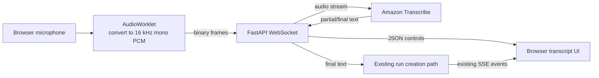

# Realtime audio learning guide

This directory explains the voice architecture as a sequence of small, testable
concepts. It is reference material, not authorization to implement a future
milestone. The authoritative milestone order remains in
`docs/implementation-plan.md` and `ai_analytics_poc_realtime_multimodal_plan.md`.

## Start here

Read this README first for the vocabulary and the one-page architecture. Then:

1. Read `current-and-v4-architecture.md` to connect voice input to the system we
   already have.
2. Read `system-and-component-evolution.md` to see how voice systems evolved and
   which dedicated components make them more sophisticated.
3. Read `industry-landscape-and-reading-guide.md` for service choices and primary
   external reading on STT, VAD, endpointing, turn detection, and TTS.
4. Read `evolved-voice-architecture.md` only after the basic input path is clear.
   It shows how the same transport can later support spoken output and barge-in.

## The short vocabulary

- **STT — speech to text:** converts audio samples into words. Streaming STT can
  emit tentative partial text before it knows the final transcript.
- **VAD — voice activity detection:** estimates whether a small audio window
  contains speech. It answers “is somebody speaking?”, not “have they finished
  their thought?”
- **Endpointing:** decides that a speech segment has ended, commonly by combining
  silence duration and STT evidence.
- **Turn detection:** decides when the user has yielded the conversational turn.
  It may use VAD, punctuation, transcript timing, and semantic meaning.
- **TTS — text to speech:** turns the assistant's text into playable audio.
- **PCM — pulse-code modulation:** raw numeric audio samples. Our basic contract is
  mono, signed 16-bit little-endian PCM at 16 kHz.
- **AudioWorklet:** browser code that processes short audio blocks on the Web
  Audio rendering thread, away from normal UI work.
- **Codec:** an algorithm that encodes and decodes media. A codec may compress raw
  PCM into smaller packets.
- **Opus:** a low-latency audio codec designed for speech, music, and realtime
  communication.
- **WebRTC:** a browser realtime-media system that commonly transports Opus audio
  and supplies encryption, congestion control, jitter handling, and connection
  negotiation.
- **MediaRecorder:** a higher-level browser API that records a media stream into
  encoded chunks or a file-like blob, commonly WebM containing Opus audio.

## The basic option we chose

For the voice-input milestone, keep the existing application architecture and add
one narrow media path:



The AudioWorklet receives browser-rate floating-point samples and our capture
component converts them to the labeled 16 kHz mono PCM contract; that format is not
guaranteed natively by the microphone or `getUserMedia`.

The WebSocket complements rather than replaces Server-Sent Events (SSE):

- WebSocket carries high-frequency microphone bytes upstream and small transcript
  or control events downstream.
- The existing SSE endpoint continues to carry the durable run's model and tool
  events downstream.
- A final transcript enters the same application-owned orchestration path as typed
  text. MCP boundaries, DynamoDB durability, Redis coordination, loop budgets, and
  cancellation semantics remain intact.

This is intentionally an STT-first architecture. It teaches realtime input while
minimizing how much of the working application changes at once.

The first interaction is manual: click **Start listening**, speak while the
WebSocket carries audio and transcript updates, then click **Stop**. Stop ends
capture and asks the recognizer to finalize; the final text starts an ordinary run,
whose answer continues over the existing SSE stream. VAD-based automatic stopping
is a later enhancement, not part of this basic mechanic.

## Reference implementation

Salesforce AI Research's
[Enterprise Realtime Voice Agent](https://github.com/SalesforceAIResearch/enterprise-realtime-voice-agent)
is useful as a tutorial for AudioWorklet capture, binary WebSocket messages, VAD,
and latency metrics. Keep it as a sibling checkout for inspection:

```bash
git clone https://github.com/SalesforceAIResearch/enterprise-realtime-voice-agent.git ../enterprise-realtime-voice-agent
```

Treat it as a collection of patterns, not as this application's architecture. It
uses different providers and simplifies persistence and orchestration. In
particular, preserve our AWS boundary: the browser sends audio only to FastAPI;
FastAPI uses its AWS task role to reach Transcribe. Never put AWS credentials in
browser code.

## Primary references

- [MDN: AudioWorkletProcessor](https://developer.mozilla.org/en-US/docs/Web/API/AudioWorkletProcessor)
- [MDN: Using AudioWorklet](https://developer.mozilla.org/en-US/docs/Web/API/Web_Audio_API/Using_AudioWorklet)
- [MDN: getUserMedia](https://developer.mozilla.org/en-US/docs/Web/API/MediaDevices/getUserMedia)
- [MDN: WebSocket.send](https://developer.mozilla.org/en-US/docs/Web/API/WebSocket/send)
- [Amazon Transcribe streaming API](https://docs.aws.amazon.com/transcribe/latest/APIReference/API_streaming_StartStreamTranscription.html)
- [Amazon Transcribe partial results](https://docs.aws.amazon.com/transcribe/latest/dg/streaming-partial-results.html)
- [CloudFront WebSocket support](https://docs.aws.amazon.com/AmazonCloudFront/latest/DeveloperGuide/distribution-working-with.websockets.html)
- [Application Load Balancer listeners](https://docs.aws.amazon.com/elasticloadbalancing/latest/application/load-balancer-listeners.html)
