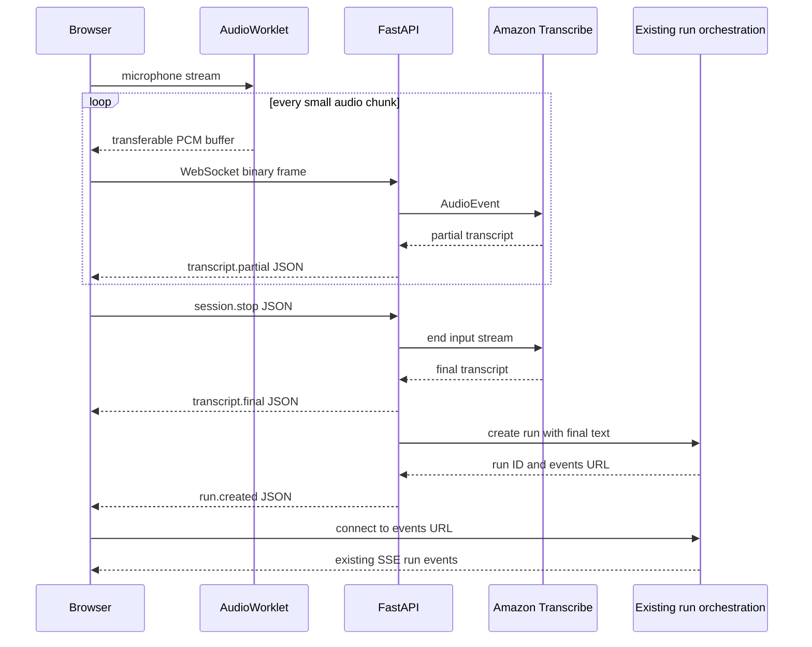

# Current and first voice-input architecture

## What the application does today

The browser currently collects a completed text prompt, sends it to
`POST /api/runs`, and listens to the run's SSE event stream. FastAPI owns model
calls and durable run state; MCP is a separate tool boundary; DynamoDB is durable
and Redis is transient coordination.

SSE is a one-way server-to-browser stream. It is a good fit for model and tool
events, but it cannot carry live microphone audio from the browser to FastAPI.
Voice input therefore needs a second, bidirectional transport.

## What we were trying to achieve

The original realtime roadmap describes the conceptual path:

```text
microphone -> transport -> speech recognition -> existing application
```

No earlier voice implementation was discarded. The missing detail was how to get
small, regularly timed audio chunks out of a browser and across the network without
turning them into bulky JSON. AudioWorklet plus a binary WebSocket makes that
boundary concrete.

## AudioWorklet capture, step by step

1. The page asks for microphone permission with `getUserMedia`. Browsers require a
   secure context, normally HTTPS outside local development.
2. A `MediaStreamAudioSourceNode` feeds the microphone into an
   `AudioWorkletNode`.
3. Its paired `AudioWorkletProcessor` receives small blocks of floating-point
   samples on the audio rendering thread. UI rendering, React updates, and typing
   therefore do not directly schedule the capture loop.
4. The capture code downmixes to mono, resamples to 16 kHz when needed, clamps each
   sample, and converts it to signed 16-bit little-endian PCM.
5. It batches a modest duration such as 20 ms and transfers the resulting buffer
   to the page through the worklet's `MessagePort`.
6. The page sends the buffer as a binary WebSocket frame.

The processor itself does not access the DOM or own the WebSocket. Its narrow job
is realtime audio processing; ordinary page code receives buffers through the
`MessagePort`, updates the UI, and performs network I/O.

At 16 kHz, a 20 ms mono chunk contains 320 samples. At two bytes per sample that is
640 bytes. Continuous audio is about 32 KB/s before WebSocket and network overhead.

The exact input device sample rate must not be assumed. Many devices supply 44.1
or 48 kHz audio even if constraints request 16 kHz, so the client must observe the
actual `AudioContext.sampleRate` and resample deliberately.

## Why raw PCM

PCM is simply a sequence of measured signal amplitudes. For this first contract:

```text
encoding: signed linear PCM
sample width: 16 bits
byte order: little-endian
channels: 1 (mono)
sample rate: 16,000 Hz
```

Binary PCM has no WAV header per chunk and no media-container negotiation. Amazon
Transcribe can consume this kind of streaming audio directly when its declared
media encoding and sample rate match.

Sending those bytes as WebSocket binary frames is preferable to embedding them in
JSON:

- Base64 increases payload size by roughly one third.
- An array of sample numbers is much larger still and costly to parse.
- Binary frames preserve the exact bytes expected by the recognizer.
- JSON remains available for infrequent, human-readable control messages.

## What audio a browser actually exposes

A browser does not emit only one audio format. `getUserMedia` first provides a
live `MediaStreamTrack`, not a WAV file or our chosen 16 kHz byte sequence. The API
used after that determines what application code sees:

```text
getUserMedia microphone track
    |
    +--> Web Audio / AudioWorklet --> Float32 PCM sample blocks
    |
    +--> MediaRecorder -----------> encoded media chunks, often WebM/Opus
    |
    +--> WebRTC ------------------> negotiated realtime media, commonly Opus
```

With Web Audio, an `AudioWorkletProcessor` normally receives floating-point PCM
values around `-1.0` to `1.0` at the actual `AudioContext.sampleRate`, commonly
44.1 or 48 kHz. Our code chooses to downmix, resample, and convert those values to
16 kHz mono signed 16-bit PCM:

```text
device Float32 PCM
    -> downmix stereo to mono when necessary
    -> resample actual device rate to 16 kHz
    -> clamp and convert Float32 to signed Int16
    -> batch samples
    -> transfer ArrayBuffer through MessagePort
    -> send ArrayBuffer as a WebSocket binary frame
```

“Binary” describes the WebSocket frame representation. It means the PCM bytes are
sent directly as an `ArrayBuffer` or typed-array view, rather than as a WebSocket
text frame. FastAPI receives those bytes and forwards the compatible audio stream
to Transcribe. The return direction carries JSON transcript controls, not the same
audio back to the browser.

## Basic browser audio alternatives

| Approach | What crosses the network | Good fit | Main cost |
|---|---|---|---|
| Binary PCM over WebSocket | Raw sample bytes | Learning, direct streaming STT, predictable server contract | More bandwidth; application owns chunking and backpressure |
| Base64 PCM in JSON | PCM represented as text | Debugging a tiny prototype | About one-third larger before JSON overhead; extra encoding and allocation |
| Numeric samples in JSON | An array such as `[12,-40,81]` | Almost never appropriate for realtime audio | Extremely bulky and expensive to parse |
| MediaRecorder upload | Encoded WebM/Opus or another browser-supported container | Record-then-submit and file workflows | Container/codec negotiation; no natural sample-level stream |
| MediaRecorder timeslices | A sequence of encoded media chunks | Simple compressed near-realtime capture | Chunks may carry container boundaries and need compatible server decoding |
| WebCodecs plus Opus | Application-controlled compressed audio frames | Fine-grained compression with browser support checks | More codec, framing, compatibility, and worker complexity |
| WebRTC plus Opus | Encrypted realtime media packets | Full-duplex conversation, weak networks, telephony, multiple participants | Signaling, ICE/TURN infrastructure, media-server integration, harder debugging |
| Complete WAV/WebM upload | One file after recording | Simplest batch STT path | Recognition starts late and cannot show live partials |

### Opus: the audio compressor

PCM contains every raw sample. Opus encodes those samples into much smaller packets
and decodes them back into PCM at the receiver:

```text
PCM samples -> Opus encoder -> compressed packets
compressed packets -> Opus decoder -> PCM samples
```

Opus is designed for low-delay speech and music. It can adjust bitrate and cope
with packet loss better than treating a complete audio file as one indivisible
object. Compression saves network bandwidth, but a downstream recognizer must
either accept Opus in the chosen framing or receive decoded PCM.

### WebRTC: the realtime media system

WebRTC is not a codec. It is a collection of protocols and browser APIs for
realtime audio, video, and data. Browser audio sessions commonly use Opus inside
WebRTC. The surrounding system adds capabilities a plain WebSocket does not provide
automatically:

- encrypted media transport;
- connection negotiation and NAT/firewall traversal with ICE, STUN, and TURN;
- congestion control and bitrate adaptation;
- packet-loss handling and jitter buffering;
- integration with browser media tracks and realtime send/receive;
- a natural full-duplex path for simultaneous capture and playback.

Echo cancellation, noise suppression, and automatic gain control are primarily
browser capture-processing features requested through `getUserMedia` constraints.
They are commonly used with WebRTC calls, but they are not themselves properties
of the WebRTC transport protocol.

WebRTC normally prefers low-latency UDP media but can use relays and fallback paths
when direct connectivity is unavailable. It may connect peers directly, or connect
the browser to an SFU/media server for routing, recording, telephony, or multiple
participants.

### WebSocket PCM versus WebRTC/Opus

| Concern | WebSocket plus PCM | WebRTC plus Opus |
|---|---|---|
| Media representation | Raw, uncompressed samples | Compressed Opus packets |
| Transport behavior | Ordered WebSocket stream over TCP | Realtime media transport, normally UDP-first |
| Bandwidth | Higher | Lower and adaptable |
| Delayed/lost packet policy | TCP retransmission can delay later bytes | Designed to keep playing despite some loss |
| Jitter and congestion | Application must design around them | Built-in media mechanisms |
| Server complexity | Small | Signaling plus ICE/TURN and often media infrastructure |
| Best first use | Start/Stop streaming transcription | Continuous, full-duplex voice interaction |

An analogy helps keep the layers separate:

> PCM is the uncompressed audio material. Opus is the compressed package.
> WebSocket is a straightforward delivery pipe. WebRTC is a complete realtime
> courier system that monitors and adapts the delivery route.

Our first milestone deliberately chooses AudioWorklet -> PCM -> WebSocket because
the learning goal is visible capture, transport, and streaming recognition with a
small architectural change. WebRTC/Opus becomes worth evaluating when the roadmap
reaches simultaneous listening and speaking, TTS playback, barge-in, unreliable
mobile networks, telephony, or multi-party sessions.

## One socket, two message classes

The first protocol should remain deliberately small:

| Direction | WebSocket type | Purpose | Example |
|---|---|---|---|
| Browser to server | Text/JSON | Session controls | `{"type":"session.start","sample_rate":16000}` |
| Browser to server | Binary | PCM audio chunks | 640-byte 20 ms chunk |
| Server to browser | Text/JSON | Readiness and transcript | `{"type":"transcript.partial","text":"show me"}` |
| Server to browser | Text/JSON | Errors or shutdown | `{"type":"voice.error","code":"stt_unavailable"}` |

Suggested lifecycle:

```text
connect
  -> session.start
  <- session.ready
  -> binary PCM chunks...
  <- transcript.partial...
  -> session.stop
  <- transcript.final
  <- run.created
  <- session.closed
```

Include a protocol version, session identifier, and trace identifier in controls or
server-side session metadata. WebSocket already preserves message order, so the
server can assign a monotonic chunk counter as binary frames arrive; the basic raw
PCM frame does not need a hidden sequence header. Set a maximum binary frame size
and reject audio before `session.ready`. Errors should have stable codes and safe
user-facing messages.

The socket is media-session state, not durable conversation state. If it closes,
the application may retain completed transcripts and runs, but it does not pretend
that transient audio was durably accepted.

## How this plugs into the existing application

### The first user interaction: explicit start and stop

The basic learning slice uses a toggle, not automatic turn detection:

1. The user clicks **Start listening**. The browser requests microphone access if
   necessary, opens the voice WebSocket, and starts the AudioWorklet.
2. While the control shows **Listening**, the browser continuously sends PCM chunks.
   The WebSocket returns `transcript.partial` messages so the user can see tentative
   words. Nothing starts an application run yet.
3. The user clicks **Stop**. The browser stops sending audio but keeps the socket
   open while FastAPI finishes the Transcribe input stream and waits for its final
   transcript result.
4. FastAPI returns `transcript.final` over the WebSocket and hands that text to the
   existing run-creation service.
5. FastAPI sends a `run.created` JSON event containing `run_id`, `conversation_id`,
   and `events_url`, matching the useful fields returned by `POST /api/runs`.
6. The browser attaches to `events_url`. The assistant's text, model events, and
   tool events stream back exactly as they do for a typed prompt.
7. The voice media session closes or returns to an idle state. The user can start a
   new recording when ready.

```text
Start listening
     |
     v
WebSocket: PCM up ------------> Transcribe
WebSocket: partial text <------ Transcribe
     |
   Stop
     |
     v
WebSocket: final text <-------- Transcribe
     |
     v
Create the ordinary application run
WebSocket: run.created { run_id, events_url } ------> browser
     |
     v
SSE: assistant answer and run events ------> browser
```

Stopping is a two-step idea: stop **capturing** new microphone samples first, then
finish and finalize the recognition stream. Closing the socket immediately on the
button click could lose the last audio or final transcript.

Push-to-talk—hold while speaking and finalize on button release—is a small UI
variation on the same protocol. The toggle is easier for longer analytical prompts
and accessibility, so it is the better first behavior. Automatic VAD/endpointing
comes later, after the manual boundary is correct and measurable.



The final-transcript handoff should call the same application service used by
`POST /api/runs`, rather than issuing a loopback HTTP request or duplicating run
logic inside the WebSocket handler. Only finalized text starts a run in the basic
milestone; partial text is presentation-only.

The existing SSE endpoint remains the run-event boundary. A new connection reads
the active Redis stream from its beginning, and terminal state can be reconciled
from the durable repository. Clients use event identifiers when resuming. This is
enough to avoid moving answer events onto the voice socket, but transient
`answer.delta` events are not guaranteed to survive loss of Redis; that existing
limitation is not changed by voice input.

Amazon Transcribe exposes partial and final results. Partial words can change, so
the UI should replace the current tentative span rather than append every partial.
When a result is final, promote it into the stable transcript.

## Why it improves the current plan

- **Lower perceived latency:** recognition begins while the person is still
  speaking instead of after a whole recording is uploaded.
- **Stable browser timing:** capture work is isolated from ordinary UI tasks.
- **Efficient transport:** audio stays binary; semantic events stay readable JSON.
- **Small architectural blast radius:** final text reuses the current orchestrator
  and SSE output path.
- **Measurability:** timestamps can expose first-audio, first-partial,
  final-transcript, run-start, and first-answer-event latency.
- **Future-compatible contract:** the same WebSocket can later carry TTS audio and
  interruption controls without forcing that complexity into the first slice.

## Production checks for the milestone

- Confirm microphone capture works only after an explicit user gesture and shows a
  visible listening state.
- Validate sample rate, encoding, channel count, message order, and size limits at
  the FastAPI boundary.
- Apply authentication and authorization before starting an AWS stream.
- Bound session length, buffered audio, concurrent streams, and reconnect attempts.
- Forward the required WebSocket upgrade headers through CloudFront and ALB.
- Configure load-balancer idle timeout and application heartbeat behavior
  deliberately; do not depend on defaults.
- Propagate cancellation and close the Transcribe stream when the user stops,
  navigates away, or loses authorization.
- Emit latency, byte-count, close-reason, recognizer-error, and finalization metrics
  without logging raw audio or sensitive transcript content by default.
