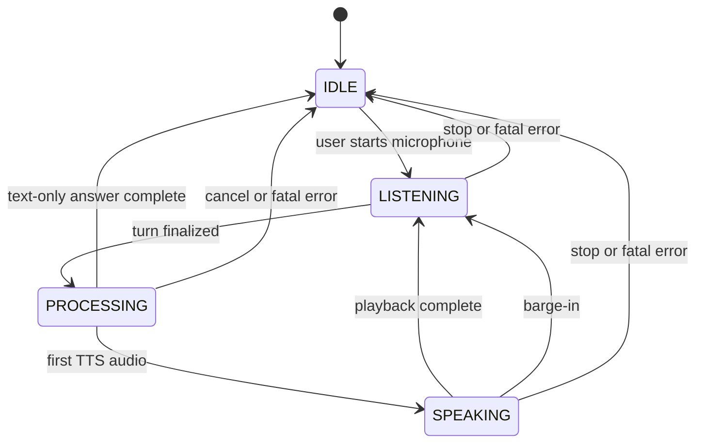

# Evolving from voice input to a realtime conversation

This document is a future learning track. It does not move TTS, barge-in, native
speech models, OpenRouter, or agent frameworks into the active milestone.

## The media state machine

A visible, explicit state machine is more useful than a single `isRecording`
boolean:



The labels mean:

- **IDLE:** no active media session;
- **LISTENING:** microphone audio is flowing and partial transcript may change;
- **PROCESSING:** the user turn is final and the application is producing an answer;
- **SPEAKING:** synthesized answer audio is playing.

Real implementations also track orthogonal flags such as connection health,
permission state, mute, reconnecting, and cancellation. Do not multiply the core
states for every combination.

The diagram shows the manual first-slice behavior: after a text-only answer, the
session returns to IDLE. A later hands-free conversational mode may deliberately
transition from PROCESSING or SPEAKING back to LISTENING, but only when automatic
turn detection and microphone policy are part of that milestone.

## Evolution by milestone

### Stage 1: voice input, text output

```text
AudioWorklet -> binary PCM WebSocket -> Transcribe -> final text
             -> existing run orchestration -> existing SSE text answer
```

This is the basic option described in `current-and-v4-architecture.md`. A manual
start/stop interaction is acceptable initially because it isolates capture,
transport, recognition, and transcript UX.

### Stage 2: automatic endpointing and turn detection

Add VAD and transcript evidence so the system can decide when to finalize a turn.
A robust order of experimentation is:

1. server-observed audio duration and a simple silence threshold;
2. a dedicated VAD model for speech-start and speech-stop evidence;
3. STT endpoint/finality signals;
4. semantic turn detection only if pauses and incomplete thoughts remain a real
   user problem.

Keep these signals observable. Log safe timing metadata such as speech-start,
last-speech, endpoint-trigger, and transcript-final timestamps. Avoid storing raw
audio by default.

### Stage 3: streaming TTS and browser playback

The application buffers bounded answer text at sentence or phrase boundaries and
sends it to TTS. The WebSocket can then carry server-to-browser binary audio while
JSON frames announce metadata:

```text
{"type":"audio.start","turn_id":"...","format":"pcm_s16le","sample_rate":24000}
<binary audio frames>
{"type":"audio.end","turn_id":"..."}
```

Use separate declared formats for capture and playback; they need not share a
sample rate. Browser playback needs a small jitter queue so network variation does
not create gaps. An AudioWorklet can consume that queue on the rendering thread.

The difficult design question is not calling a TTS API. It is deciding how much
text to buffer. Small fragments speak sooner but can sound unnatural and are
harder to cancel cleanly; large fragments sound better but increase first-audio
latency.

### Stage 4: barge-in and full duplex behavior

When speech begins during SPEAKING:

1. VAD marks a probable interruption.
2. The browser immediately fades or stops queued playback.
3. FastAPI cancels outstanding TTS and the active run where appropriate.
4. Stale frames carry a turn identifier and are ignored if they arrive late.
5. The state returns to LISTENING and the new user turn begins.

Cancellation must propagate through every layer. Stopping only browser audio while
the model, tools, or TTS continue wastes cost and risks replaying stale content.
The application remains the authority for that cancellation; the MCP server does
not acquire a conversational loop.

## Reusable ideas from the Salesforce tutorial

Strong patterns to adapt:

- AudioWorklet capture instead of a timer on the UI thread;
- binary PCM frames for media and JSON frames for controls;
- an explicit IDLE -> LISTENING -> PROCESSING -> SPEAKING model;
- VAD as one signal in turn management;
- per-stage and end-to-end latency instrumentation;
- bounded queues and clear cleanup on disconnect.

Patterns not to copy wholesale:

- provider choices that break the AWS-only POC boundary;
- in-memory conversation as authoritative state;
- LLM calls outside the application service;
- tutorial shortcuts around authentication, reconnects, quotas, and deployment;
- a single summed benchmark presented as actual live end-to-end latency.

## Deployment effects

The existing CloudFront -> ALB -> FastAPI route can support WebSockets, but the
production contract must explicitly cover:

- forwarding WebSocket upgrade headers through CloudFront;
- ALB idle timeout and heartbeat intervals;
- connection draining during deployment;
- one ECS task owning a live socket and its Transcribe stream;
- backpressure and per-user concurrent-session limits;
- trace correlation across WebSocket session, Transcribe stream, durable run, and
  SSE connection.

Redis may coordinate ephemeral presence or cancellation, but it must not become
the durable transcript or conversation database.

## Later experiments, after voice capability

These are useful comparison tracks only after the staged voice architecture works:

- **Native speech-to-speech:** compare Nova 2 Sonic or another realtime model with
  the modular STT -> LLM -> TTS pipeline for latency, control, transcript quality,
  observability, and tool integration.
- **Pipecat or LiveKit Agents:** study their transport, turn-taking, and pipeline
  abstractions before deciding whether a framework removes more complexity than it
  adds.
- **OpenRouter:** useful for comparing text-model routing behind a narrow model
  interface, but it does not solve browser audio, VAD, STT, TTS, or barge-in.
- **CrewAI:** useful when a future problem genuinely needs multi-agent delegation;
  it is orthogonal to the realtime media loop and should not own audio transport or
  durable application state.

Keeping these after voice is the right order: first learn the realtime media and
turn-taking contracts, then evaluate abstractions with concrete requirements and
latency measurements.
