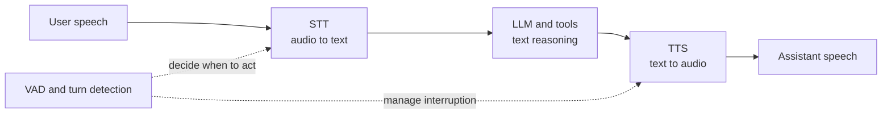

# Voice concepts, service landscape, and reading guide

## The three core transformations

### STT: speech to text

STT recognizes words from audio. Batch STT waits for a recording; streaming STT
accepts chunks and emits results during speech. Streaming results are usually:

- **partial/interim:** fast and tentative; later text may replace them;
- **final:** the recognizer has closed that result segment and will not revise it.

Partial does not mean incorrect, and final does not necessarily mean the user has
finished the conversational turn. A recognizer can finalize a phrase while the
person pauses briefly and then continues.

### VAD: voice activity detection

VAD classifies short audio windows as speech or non-speech. It can:

- avoid sending or processing long silence;
- drive the LISTENING visual state;
- detect that a person started talking while the assistant is speaking;
- contribute evidence to endpointing.

It cannot reliably infer intent. “Book a flight to …” followed by a thinking pause
may be silence without being a finished turn.

### TTS: text to speech

TTS synthesizes playable audio from assistant text. Streaming TTS can start from a
small text buffer before the entire answer is complete. That reduces time to first
audio but adds ordering, buffering, cancellation, and playback concerns.

## Related concepts that prevent common mistakes

- **Endpointing** closes an acoustic or transcript segment after evidence such as a
  silence threshold. A short threshold feels responsive but interrupts hesitant
  speakers; a long one feels slow.
- **Turn detection** answers the broader question “should the assistant respond
  now?” Semantic models can recognize that a grammatically or conceptually
  incomplete thought likely needs more time.
- **Barge-in** lets a user speak over the assistant. It requires speech-start
  detection, cancellation of model/TTS work, clearing queued playback, and a new
  turn boundary.
- **Echo cancellation** keeps speaker output from being mistaken for new user
  speech. Browser media constraints help, but headset and device behavior still
  need testing.

## What is industry standard?

There is no single universal provider. There are three common architecture shapes:

| Shape | Examples | Strengths | Trade-offs |
|---|---|---|---|
| Cloud-platform STT plus separate LLM/TTS | Amazon Transcribe, Google Cloud Speech-to-Text, Azure Speech | Explicit components, enterprise controls, provider observability | More integration and turn-management work |
| Specialist voice APIs | Deepgram and comparable STT/TTS services | Voice-focused latency/features and approachable realtime APIs | Another provider, security review, and operational boundary |
| Native speech-to-speech model | Amazon Nova Sonic, OpenAI Realtime and similar APIs | Natural timing and simpler end-to-end conversation loop | Less component-level control and a larger architectural jump |

An explicit STT -> LLM -> TTS pipeline remains a common production choice because
each stage is observable and replaceable. LiveKit's voice-agent documentation also
describes this pipeline as the appropriate default for most production agents.

## Why Amazon Transcribe is the basic choice here

Amazon Transcribe is not automatically best for every voice product. It is the
best first comparison point for this POC because:

- the requirements intentionally keep the runtime AWS-only;
- ECS can authenticate through its task role instead of distributing another
  vendor secret;
- it provides a streaming API with partial and final results;
- its PCM contract fits the AudioWorklet/WebSocket design;
- using a separate recognizer preserves the existing application-owned LLM and
  tool orchestration.

This choice is architectural discipline, not vendor lock-in. Define a small
internal recognizer boundary around audio input and transcript events so a later
benchmark can compare another provider without changing browser protocol or run
orchestration.

## A sensible evaluation scorecard

When a future milestone authorizes provider comparison, use representative audio
from expected users and measure:

- first-partial and final-transcript latency;
- word error rate, including names and domain terminology;
- endpoint behavior for pauses, corrections, accents, and noisy rooms;
- streaming stability: how often partial text is revised;
- supported language, punctuation, vocabulary, diarization, and compliance needs;
- cost per audio minute and concurrent-stream quotas;
- regional availability, data retention, encryption, and private-network options;
- SDK quality, reconnect behavior, observability, and operational burden.

Do not choose from a single polished demo. Browser microphone quality, real network
jitter, and users' speaking styles dominate many laboratory comparisons.

## Reading path

### 1. Browser audio

- [MDN: getUserMedia](https://developer.mozilla.org/en-US/docs/Web/API/MediaDevices/getUserMedia)
  for permissions, secure contexts, and device streams.
- [MDN: Using AudioWorklet](https://developer.mozilla.org/en-US/docs/Web/API/Web_Audio_API/Using_AudioWorklet)
  for the node/processor split and message port.
- Inspect Chapter 7 in the
  [Salesforce tutorial](https://github.com/SalesforceAIResearch/enterprise-realtime-voice-agent/tree/main/chapters/07_web_client)
  after understanding the browser APIs.

### 2. Streaming transcription

- [Amazon Transcribe streaming setup](https://docs.aws.amazon.com/transcribe/latest/dg/streaming-setting-up.html)
  for the service transport model.
- [Amazon Transcribe partial results](https://docs.aws.amazon.com/transcribe/latest/dg/streaming-partial-results.html)
  for partial, final, and stabilization behavior.
- [Google streaming recognition](https://docs.cloud.google.com/speech-to-text/docs/streaming-recognize)
  as a comparison of the same concepts over gRPC.
- The current Deepgram page on
  [interim results](https://developers.deepgram.com/docs/interim-results) and its
  [endpointing guide](https://developers.deepgram.com/docs/endpointing) are useful
  vendor-neutral learning examples even though Deepgram is not our baseline.

### 3. Turn taking

- [LiveKit turn detection overview](https://docs.livekit.io/agents/logic/turns/)
  for a clear comparison of VAD, STT endpointing, semantic turn detection, realtime
  models, and manual control.
- [Deepgram utterance-end events](https://developers.deepgram.com/docs/utterance-end)
  for the distinction between transcript timing and raw audio silence.

### 4. Evolved voice systems

- [LiveKit pipeline types](https://docs.livekit.io/agents/models/pipelines/)
  for modular versus realtime-model pipelines.
- [Amazon Nova 2 Sonic getting started](https://docs.aws.amazon.com/nova/latest/nova2-userguide/sonic-getting-started.html)
  and [OpenAI Realtime API](https://platform.openai.com/docs/api-reference/realtime)
  as later speech-to-speech comparisons, not first-milestone dependencies.

## How to read the Salesforce repository critically

The repository is a helpful Apache-licensed tutorial, especially for AudioWorklet,
binary messages, VAD, and metrics. It is not a drop-in production framework for
this application:

- it demonstrates providers that differ from our AWS baseline;
- tutorial chapters simplify persistence, identity, reconnection, and orchestration;
- some chapters are intentionally incremental and do not yet implement the fully
  streaming behavior their eventual architecture describes;
- component timing added together is useful pedagogy but is not a substitute for
  observed end-to-end latency under concurrency.

Reuse the concepts and test techniques. Keep our application/MCP ownership,
durable-state model, security boundary, and milestone sequencing.
