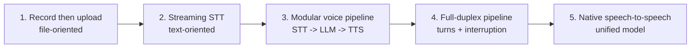
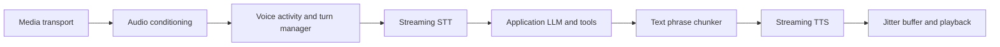

# System design, component design, and how voice systems evolved

## Two levels of design

**System design** describes the whole product boundary: which services exist, who
owns state, how data crosses the network, what happens when something fails, and
how the system scales and stays secure.

For our basic voice slice, system-design questions include:

- Why use WebSocket for the microphone but keep SSE for run output?
- Does the browser call Amazon Transcribe directly or through FastAPI?
- Where is the transcript durable, and what is lost if a socket disconnects?
- Which service owns the LLM, MCP loop, authentication, cancellation, and quotas?
- How do CloudFront, ALB, ECS, Redis, and DynamoDB participate?

**Component design** zooms into one box and defines its internal contract and
algorithm.

For the AudioWorklet capture component, questions include:

- What sample rate arrives from the device?
- How are stereo channels downmixed and samples resampled?
- How are floating-point samples converted to signed 16-bit PCM?
- How large is each chunk, and how does backpressure work?
- What message crosses the worklet `MessagePort` on start, stop, or error?

Good system design gives each component one clear job. Good component design makes
that job correct, measurable, bounded, and replaceable.

## The evolution of voice application design



### 1. Record, upload, wait

Early web voice features commonly recorded a complete WAV or compressed media blob,
uploaded it with an HTTP request, waited for batch transcription, then submitted
the text.

This is easy to reason about but latency is additive:

```text
recording duration + upload + transcription + LLM + optional TTS
```

It also offers no partial transcript and cannot respond until the user explicitly
finishes the whole recording.

### 2. Streaming recognition

The next step opens a persistent connection and sends small audio chunks as they
are captured. STT works while the user is talking and returns partial text. This is
the stage we are choosing first.

The sophistication is not “more AI”; it is a better realtime contract:

- AudioWorklet produces regularly timed samples.
- A resampler/encoder establishes one explicit media format.
- A WebSocket carries binary audio and structured controls.
- Streaming STT returns replaceable partials and stable finals.
- The existing application starts only from final text.

### 3. Modular STT -> LLM -> TTS pipeline

Spoken output adds a TTS component after the model. Each stage is observable and
replaceable:



This architecture is still common because teams can inspect the transcript, use a
text LLM of their choice, moderate each boundary, customize voices, and measure
each source of latency. Pipecat and LiveKit Agents are examples of frameworks that
package these pipeline concepts; they are future learning references, not current
dependencies.

### 4. Full-duplex conversational pipeline

Natural conversation allows capture and playback at the same time. That introduces
dedicated turn and interruption components. When the user starts talking during
assistant playback, the system must distinguish real speech from echo, stop queued
audio, cancel obsolete work, and begin a new turn without mixing session state.

This stage needs an event-driven design. Events such as `user.speech_started`,
`turn.committed`, `assistant.audio_started`, and `turn.cancelled` coordinate
components without hiding ownership.

### 5. Native speech-to-speech models

Newer realtime models accept audio and produce audio over one bidirectional session.
They can jointly model words, timing, prosody, pauses, and interruptions instead of
forcing every interaction through a complete text boundary. Amazon Nova 2 Sonic's
documentation describes a persistent event stream that can return user
transcription, tool-use events, text, and audio.

This removes some visible components, but not the system-design responsibilities.
Authentication, browser transport, tool authorization, durable application state,
cancellation, observability, and safety still belong somewhere explicit. Native
speech-to-speech is an architectural alternative to benchmark after the modular
pipeline is understood, not an automatic upgrade.

## Dedicated components that add sophistication

Sophistication should mean solving a measured problem with a component that has a
clear contract—not simply adding more services.

| Dedicated component | Problem it solves | Start simple | More sophisticated form |
|---|---|---|---|
| Capture engine | Regular microphone samples without UI jitter | AudioWorklet capture | device switching, capture health, adaptive chunking |
| Audio conditioner | STT receives a predictable signal | mono resampling and PCM conversion | automatic gain control, denoising, echo cancellation |
| Media transport | Low-latency ordered bytes and controls | WebSocket | WebRTC with congestion control and media routing |
| Stream session manager | Lifecycle, auth, limits, cleanup | one FastAPI socket/session | resumable sessions, admission control, regional routing |
| Streaming STT adapter | Provider-specific audio/results | Amazon Transcribe adapter | provider benchmark/failover, vocabulary and language routing |
| Transcript assembler | Partials revise earlier words | replace one tentative span | word stability, timestamps, confidence and correction UX |
| VAD | Detect speech versus silence | absent; manual controls define capture | neural VAD with calibrated speech-start/stop thresholds |
| Endpoint detector | Decide an acoustic segment ended | absent; Stop explicitly ends input | silence plus STT endpoint/finality evidence |
| Turn manager | Decide the user yielded intent | absent; Stop manually commits the turn | semantic/acoustic end-of-turn model and policy |
| Context/orchestrator | Own LLM, tools and durable state | existing FastAPI run path | concurrent tool handling with bounded cancellation |
| Response chunker | Feed TTS natural units promptly | sentence buffering | punctuation/prosody-aware phrase scheduling |
| Streaming TTS adapter | Turn text into audio | one voice/provider | style/language routing and pronunciation dictionaries |
| Playback engine | Smooth sound despite network jitter | queued browser buffers | AudioWorklet jitter buffer, drift correction, underrun metrics |
| Interruption controller | Stop obsolete response on barge-in | absent; ordinary run cancellation remains | VAD speech-start, turn IDs, distributed cancellation |
| Observability pipeline | Explain latency and failures | timestamps and close codes | per-stage traces, quality evaluation, audio-safe diagnostics |
| Safety/privacy boundary | Prevent misuse and over-retention | auth, limits, no raw logs | consent policy, redaction, moderation, retention controls |

## Components becoming more specialized

Current voice frameworks and providers increasingly expose these capabilities as
first-class modules:

- **Neural VAD:** a model such as Silero estimates speech probability more robustly
  than raw volume thresholds.
- **Semantic/acoustic turn detectors:** dedicated models combine meaning with cues
  such as rhythm and intonation. LiveKit documents a turn detector layered above
  VAD; Pipecat exposes separate VAD and user-turn strategies.
- **Frame processors:** typed audio, transcription, control, interruption, and
  lifecycle frames travel through a pipeline. This makes cancellation and
  observability composable.
- **Realtime media infrastructure:** WebRTC services add adaptive congestion
  control, device handling, rooms, telephony bridges, and selective forwarding.
- **Unified speech models:** systems such as Nova 2 Sonic combine speech
  understanding, dialog, tool events, and speech generation in one streaming model.
- **Evaluation systems:** dedicated datasets and traces measure word accuracy,
  end-of-turn timing, interruption success, first-audio latency, and conversation
  quality instead of relying on a demo impression.

These components are “coming up” because voice quality is often limited by timing
and coordination rather than raw LLM intelligence. The most valuable improvements
frequently happen before or after the LLM.

## A sophistication ladder for this project

Each rung earns the next one with observable behavior:

1. **Manual streaming input:** Start/Stop, AudioWorklet, PCM WebSocket, Transcribe
   partial/final, existing run/SSE output.
2. **Harden the media session:** auth, size and duration limits, backpressure,
   reconnect policy, CloudFront/ALB settings, latency traces.
3. **Assist turn boundaries:** VAD for feedback and metrics, then endpointing. Keep
   manual Stop as an accessible fallback.
4. **Speak answers:** streaming TTS, phrase chunker, browser playback queue, explicit
   playback format and cancellation.
5. **Support barge-in:** full-duplex capture, echo testing, speech-start events,
   turn IDs, and end-to-end cancellation.
6. **Improve turn intelligence:** add semantic/acoustic turn detection only after
   real traces show premature or slow turns.
7. **Compare architectures:** benchmark the modular pipeline against Nova 2 Sonic or
   another native speech-to-speech model using the same tasks and metrics.
8. **Consider frameworks:** evaluate Pipecat or LiveKit against the complexity we
   have now measured. Adopt only the bounded pieces that improve ownership or
   reliability.

OpenRouter and CrewAI remain later, orthogonal tracks. Model routing can diversify
the text-reasoning component; a multi-agent framework can coordinate specialized
reasoners. Neither replaces capture, media transport, turn detection, playback, or
the application's durable-state authority.

## Current primary references

- [Pipecat server pipeline reference](https://docs.pipecat.ai/api-reference/server/introduction)
- [Pipecat speech input and turn detection](https://docs.pipecat.ai/pipecat/learn/speech-input)
- [LiveKit turn detector](https://docs.livekit.io/agents/logic/turns/turn-detector/)
- [LiveKit voice pipeline types](https://docs.livekit.io/agents/models/pipelines/)
- [Amazon Nova 2 Sonic getting started](https://docs.aws.amazon.com/nova/latest/nova2-userguide/sonic-getting-started.html)
- [Amazon Nova Sonic version 1 architecture](https://docs.aws.amazon.com/nova/latest/userguide/speech.html)
  for the architectural explanation only; version 1 is a legacy model, so new
  experiments should use the current Nova 2 documentation and verify lifecycle.
