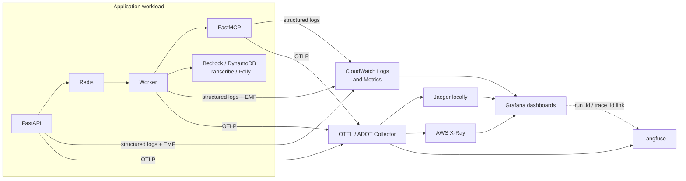
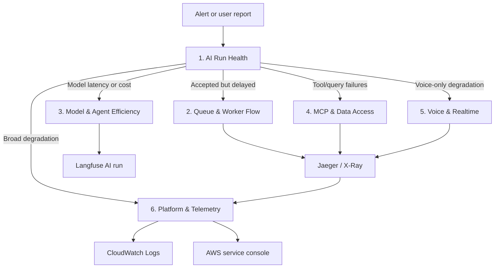
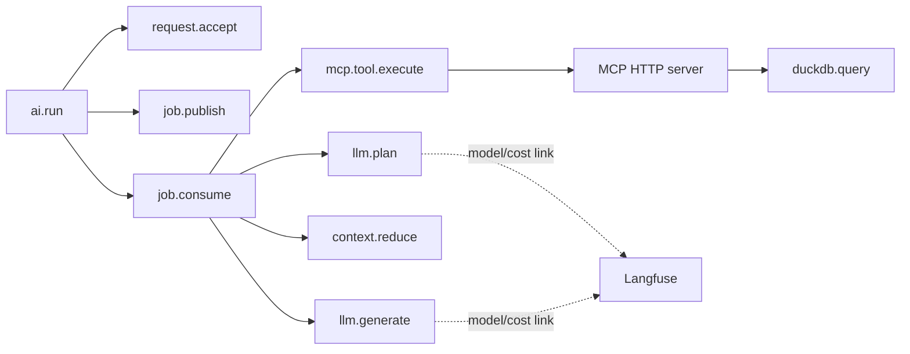

# Day-2 Observability Dashboard Side Project

## Status

Proposed follow-up to ADR 0007. This document defines a bounded side project; it does not expand the initial OpenTelemetry tracing milestone.

## Goal

Build a small, provisioned Grafana console that answers six Day-2 questions:

1. **Are users receiving successful, timely AI answers?**
2. **Is work moving cleanly from the API through Redis to the worker?**
3. **Which model behavior is driving latency, tokens, or cost?**
4. **Is MCP or governed data access the bottleneck?**
5. **Where is realtime voice latency or interruption failing?**
6. **Are the runtime, AWS dependencies, and telemetry pipeline healthy?**

Grafana is the navigation and aggregation layer. Jaeger or AWS X-Ray remains the distributed-trace viewer, Langfuse remains the AI-native run viewer, CloudWatch remains the AWS operational authority, and the existing Timeline Inspector remains the semantic run view.

## What to reuse from class9b

The class9b reference project provisions ten Grafana dashboards for an inference-routing system. Its Kubernetes, vLLM, GPU, KEDA, HAMi, and Mooncake metrics do not match this application, but several design patterns transfer directly.

| class9b pattern | Reuse here | Adaptation |
| --- | --- | --- |
| Start with overview and success/failure dashboards | Begin with user outcome and traffic health | Runs, answer success, cancellation, latency, tokens, and cost |
| Move from gateway to router to replicas | Drill from request to AI stages to runtime | API → Redis → worker → MCP → DuckDB/Bedrock |
| Generate dashboard JSON from Python | Keep dashboards deterministic and reviewable | A small dashboard builder emits six JSON files |
| Declare required metric names per dashboard | Treat panels as a tested telemetry contract | Tests fail when a required metric or data link disappears |
| Provision dashboards automatically | Avoid undocumented UI-only dashboards | Docker bind mounts locally; API/Terraform for managed Grafana |
| Use short refresh and a one-hour default window | Make live demonstrations responsive | Configurable refresh; avoid expensive high-frequency AWS queries |
| Pair stat panels with time series and p95 views | Show current state plus trend and tail behavior | p50/p95/p99 for run and stage latency |
| Give operators a broad-to-narrow walkthrough | Make investigation teachable | Dashboard 1 routes to the focused subsystem dashboard, then to traces/logs/AI evidence |

Do not copy class9b's Kubernetes deployment, Prometheus-only assumptions, or hardware-specific panels. This project deploys to ECS/Fargate and already uses CloudWatch EMF.

## System view



## Investigation flow



The dashboards should link to deeper evidence rather than attempting to reproduce full trace waterfalls, logs, or prompt/model inspection inside panels.

## Dashboard 1 — AI Run Health

**Question:** Are users receiving successful, timely, and reasonably priced answers?

**Primary audience:** developer, demo operator, and product/engineering reviewer.

**Default variables:** environment, milestone, model, turn type, strategy, and status. Do not use `run_id`, `conversation_id`, or `trace_id` as metric dimensions.

### Troubleshooting story

During a demo, answers suddenly feel slow. This dashboard first establishes whether the problem is real and broad: traffic is unchanged, success remains high, but p95 end-to-end latency and TTFT both rise. The operator then segments by model and turn type. If only voice runs degrade, continue to Dashboard 5. If all runs degrade before the first token, continue to Dashboard 3. If success drops across every segment, continue to Dashboard 6.

### Proposed panels

| Row | Panel | Signal | Purpose |
| --- | --- | --- | --- |
| Outcomes | Runs/minute | EMF count/rate | Traffic baseline |
| Outcomes | Success ratio | completed ÷ terminal runs | User-visible reliability |
| Outcomes | Failed and cancelled runs | EMF status | Separate errors from deliberate cancellation |
| Outcomes | Estimated cost | EMF sum and per-run average | Detect cost drift |
| Latency | End-to-end p50/p95/p99 | EMF latency | Typical and tail experience |
| Latency | TTFT p50/p95 | EMF TTFT | Perceived responsiveness |
| Latency | Stage p95 comparison | EMF stage latencies | Planning vs tool vs final generation |
| Usage | Input/output tokens | EMF token counts | Context and generation growth |
| Segments | Success and p95 by model | EMF model dimension | Model comparison |
| Segments | Success and p95 by turn type | EMF turn-type dimension | Text/voice comparison |

### How to read changes

| Signal or trend | What it usually indicates | Next check |
| --- | --- | --- |
| Runs/minute rises while success ratio is stable | Normal traffic growth | Confirm queue wait and runtime capacity in Dashboards 2 and 6 |
| Runs/minute falls unexpectedly | Client/API traffic loss, routing issue, or no workload | API logs, ALB/request metrics, deployment events |
| Failure ratio rises while cancellation is flat | Real application/dependency failures | Split by stage; open failed traces |
| Cancellation rises without failures | User interruption or intentional abort behavior | Voice/barge-in view and cancellation spans |
| p50 is stable but p95/p99 rises | A subset of runs, models, or tools is slow | Segment by model/tool and inspect slow traces |
| TTFT rises but tool latency is stable | Model/provider delay or larger prompt context | Dashboard 3 token and model latency panels |
| Tokens/run or cost/run trends upward | Context growth, longer outputs, loop growth, or model change | Dashboard 3 by strategy, step, and model |
| All values flatline at exactly zero during traffic | Missing telemetry, not necessarily perfect health | Dashboard 6 trace/metric coverage and Collector health |

### Drill-down behavior

- A failed-run or slow-run table links by `trace_id` to Jaeger/X-Ray.
- The same row links by `run_id` to Langfuse and, when available, the Timeline Inspector.
- A log link searches `run_id`, `conversation_id`, or `trace_id` in CloudWatch Logs Insights.

## Dashboard 2 — Queue & Worker Flow

**Question:** Is accepted work moving through Redis and the worker without delay, loss, or duplication?

**Primary audience:** application engineer and operator.

**Default variables:** environment, queue, worker service, job status, and strategy.

### Troubleshooting story

The API returns a `run_id` immediately, but the Timeline Inspector does not begin updating for several seconds. Queue depth and oldest-job age are rising, publish rate exceeds consume rate, and worker active jobs are at their limit. That points to worker capacity or a stuck consumer—not Bedrock or MCP. If queue time is normal but processing time rises, the investigation moves to Dashboards 3 and 4.

### Proposed panels

| Row | Panel | Signal | Purpose |
| --- | --- | --- | --- |
| Flow | Job publish and consume rate | `ai_jobs_published_total`, `ai_jobs_consumed_total` | Detect growing imbalance |
| Flow | Publish-to-consume p50/p95 | `ai_job_queue_wait_ms` or OTEL span duration | Measure time waiting for a worker |
| Backlog | Queue depth | `ai_job_queue_depth` | Current queued work |
| Backlog | Oldest-job age | `ai_job_oldest_age_seconds` | Detect starvation hidden by average depth |
| Workers | Active jobs and available slots | `ai_worker_active_jobs`, configured concurrency | Identify saturation |
| Workers | Processing p50/p95 | `ai_job_processing_ms` | Separate queue delay from execution delay |
| Reliability | Retries, duplicate claims, dead/failed jobs | job lifecycle counters | Detect poison jobs or delivery problems |
| Traces | Slowest queue/worker traces | Jaeger/X-Ray query | Open the exact causal path |

### How to read changes

| Signal or trend | What it usually indicates | Next check |
| --- | --- | --- |
| Publish rate exceeds consume rate and depth rises | Worker throughput is below arrival rate | Worker count, concurrency, CPU/memory, downstream latency |
| Depth is low but oldest-job age rises | A job is stranded, visibility/claim logic is stuck, or priority is unfair | Inspect the oldest job and worker logs |
| Queue wait rises while processing stays flat | Insufficient worker capacity | Dashboard 6 ECS task count and saturation |
| Processing rises while queue wait stays flat | Downstream model/tool work is slower | Dashboards 3 and 4 |
| Consume rate drops to zero with published jobs | Worker unavailable or disconnected from Redis | Worker health, Redis connectivity, deployment events |
| Retries rise with one repeated error | Poison job or deterministic application failure | Failed trace and correlated job/run logs |
| Consumed count exceeds unique terminal jobs | Duplicate delivery/claim or idempotency problem | Job ownership and terminal-state writes |

### Expected trace shape



This dashboard depends on the OTEL work in ADR 0007. Panels must be marked unavailable until the underlying span or metric contract exists; empty panels must not silently imply healthy behavior.

## Dashboard 3 — Model & Agent Efficiency

**Question:** Which model call, strategy, or loop behavior is driving latency, token use, cost, or errors?

**Primary audience:** AI/application engineer and cost reviewer.

**Default variables:** environment, model, operation (`plan` or `generate`), strategy, step index, turn type, and status.

### Troubleshooting story

Overall latency and cost rise after a prompt or model change, but tool execution is stable. Generation output tokens are unchanged while planning input tokens and ReAct steps climb. The dashboard indicates context or loop expansion rather than provider slowness. The engineer opens representative `run_id` values in Langfuse to inspect the AI hierarchy without putting raw prompts in Grafana.

### Proposed panels

| Row | Panel | Signal | Purpose |
| --- | --- | --- | --- |
| Latency | Plan and generation p50/p95/p99 | model span duration | Compare model phases |
| Responsiveness | TTFT p50/p95 | EMF and model span event | Detect delayed first output |
| Tokens | Input/output tokens per operation | GenAI span attributes and EMF | Explain context/output growth |
| Cost | Estimated cost per run and operation | bounded model/run attribute and EMF | Attribute cost movement |
| Strategy | Runs, success, latency, and cost by strategy | strategy/turn-type dimension | Compare direct vs ReAct paths |
| Loops | Steps and tool calls per run | `ai.step_index` and tool-span count | Detect runaway or ineffective loops |
| Reliability | Model errors, throttles, retries | span status and provider metrics | Separate client faults from provider pressure |
| Inspection | Slowest/costliest runs | trace query with Langfuse data link | Open representative AI runs |

### How to read changes

| Signal or trend | What it usually indicates | Next check |
| --- | --- | --- |
| Input tokens rise with conversation length | Expected context growth or ineffective reduction | Context-reducer output and prompt-size policy |
| Input tokens jump for all runs after a release | Prompt/schema expansion | Compare release and milestone dimensions |
| Output tokens rise while success is flat | More verbose generation or missing stop constraints | Model configuration and response contract |
| TTFT rises but total generation duration is stable | Provider scheduling/network delay or larger prefill | Bedrock throttles, input tokens, regional health |
| Total model duration rises with output tokens | Longer generation is the likely cause | Tokens/second and output limits |
| ReAct steps/tool calls rise | Harder queries, weak planning, or loop-regression risk | Open high-step runs in Langfuse |
| Cost rises without token growth | Model/pricing/configuration change | Model identifier and cost-estimation version |
| Errors/throttles rise across models | Provider/account quota or network issue | Dashboard 6 and AWS service diagnostics |

## Dashboard 4 — MCP & Data Access

**Question:** Is MCP transport, tool execution, governance, or DuckDB query work causing failure or delay?

**Primary audience:** application, MCP, and analytics engineer.

**Default variables:** environment, MCP service, tool name, dataset/profile, query class, and status. Raw SQL is never a dashboard label.

### Troubleshooting story

Runs succeed slowly only when analytics tools are required. MCP HTTP time is high, but `duckdb.query` duration is low, indicating transport/service contention rather than query complexity. In another incident, MCP time is normal while DuckDB p95 and governed-query rejection counts rise; that points to the data/query layer. The trace link distinguishes these cases in one request.

### Proposed panels

| Row | Panel | Logical metric/source | Purpose |
| --- | --- | --- | --- |
| Traffic | Tool calls/minute by tool | MCP/tool span count | Establish tool demand |
| Transport | MCP client/server p50/p95 | HTTP client/server spans | Detect network or service overhead |
| Execution | Tool p50/p95/p99 | `mcp.tool.execute` duration | Compare tool behavior |
| Query | DuckDB query p50/p95 | `duckdb.query` duration | Identify data execution cost |
| Governance | Validation/rejection count by reason | bounded governed-query status | Distinguish safe rejection from system error |
| Reliability | MCP/tool error rate and timeout count | span status/error type | Identify failing boundary |
| Payload | Result rows/bytes, bounded buckets | safe tool result attributes | Detect unexpectedly large results |
| Inspection | Slow/error tool traces | Jaeger/X-Ray query | Open MCP and DuckDB child spans |

### How to read changes

| Signal or trend | What it usually indicates | Next check |
| --- | --- | --- |
| MCP latency rises while DuckDB stays flat | Transport, MCP saturation, serialization, or connection setup | MCP CPU/memory, HTTP spans, client connection reuse |
| DuckDB p95 rises with result size | Heavier scans/aggregations or oversized result sets | Query class, data volume, governance limits |
| Governance rejections rise but system errors do not | Model is proposing invalid/disallowed queries | Planner/tool schema and rejection reasons |
| Timeouts rise without latency trend | Hard timeout boundary, connection churn, or abrupt service loss | Timeout config and error traces |
| Tool calls/run rises | Planning loop inefficiency or queries split too finely | Dashboard 3 step count and Langfuse run |
| Error rate rises for one tool only | Tool-specific regression or dataset issue | Filter traces and logs by stable tool name |
| Tool traffic drops to zero while analytical runs continue | Instrumentation gap or planner stopped calling tools | Trace coverage and plan output behavior |

## Dashboard 5 — Voice & Realtime Experience

**Question:** Which part of speech input, reasoning, speech output, or interruption controls the conversational experience?

**Primary audience:** realtime/voice and application engineer.

**Default variables:** environment, voice provider, model, turn type, completion status, and interruption outcome.

### Troubleshooting story

Text runs remain healthy, but users report awkward voice pauses. End-of-speech to STT-final is stable, while LLM TTFT rises; the voice transport is not the cause. In a different session, time-to-first-audio rises with stable model timing, pointing to Polly or audio delivery. Barge-in panels then verify whether detected speech actually stops playback and model generation promptly.

### Proposed panels

| Row | Panel | Logical metric/source | Purpose |
| --- | --- | --- | --- |
| Input | End-of-speech → STT final p50/p95 | voice spans/events | Measure recognition finalization |
| Reasoning | STT final → LLM first token p50/p95 | correlated voice/model spans | Isolate thinking/startup delay |
| Output | Text ready → TTS first audio p50/p95 | Polly/audio spans | Measure speech startup |
| Experience | End-of-speech → first audio p50/p95 | derived turn metric | User-perceived pause |
| Streaming | Audio chunk gaps and underruns | bounded streaming metrics | Detect choppy playback |
| Barge-in | Speech detected → audio stopped | cancellation spans/events | Measure interruption responsiveness |
| Cancellation | Model/tool cancellation duration | cancellation spans | Detect wasted work after barge-in |
| Reliability | STT/TTS/WebSocket errors and disconnects | spans and structured events | Locate provider vs transport failures |
| Efficiency | Avoided tokens/audio after interruption | cancellation telemetry | Quantify saved work |

### How to read changes

| Signal or trend | What it usually indicates | Next check |
| --- | --- | --- |
| STT finalization rises alone | End-of-speech detection, network, or Transcribe degradation | STT provider spans and WebSocket events |
| LLM TTFT rises while STT is stable | Model/context/provider issue, not voice capture | Dashboard 3 |
| TTS first-audio rises while text generation is stable | Polly request or audio startup issue | Polly spans, output size, network |
| First-audio is healthy but chunk gaps rise | Streaming delivery/playback buffering problem | WebSocket/audio buffer events |
| Barge-in detection is fast but audio stop is slow | Client playback cancellation lag | Frontend stop event and audio queue |
| Audio stops but model cancellation is slow | Backend abort propagation gap | Worker/model cancellation trace |
| Disconnects rise only on long turns | Timeout, proxy, or heartbeat issue | WebSocket lifetime and infrastructure logs |
| Avoided work falls despite frequent interruption | Cancellation happens too late or does not reach providers | End-to-end cancellation spans |

## Dashboard 6 — Platform & Telemetry Health

**Question:** Is the platform healthy, which managed dependency is limiting it, and can the observability system itself be trusted?

**Primary audience:** operator and platform engineer.

**Default variables:** environment, ECS service/task, application service, AWS region, and dependency.

### Troubleshooting story

Failure rate rises across models and tools at the same time. ECS task counts and CPU are healthy, but DynamoDB throttles rise and state-write spans fail. That moves the response directly to the durable-state dependency. Separately, if dashboards show zeros while request logs continue, Collector export failures or trace coverage reveal an observability outage rather than a perfectly healthy system.

### Proposed panels

| Row | Panel | Logical metric/source | Purpose |
| --- | --- | --- | --- |
| Service | API/worker/MCP request and error rates | CloudWatch/OTEL | Service health at a glance |
| Service | ECS desired/running tasks | ECS CloudWatch metrics | Missing or unstable capacity |
| Service | CPU and memory by service | ECS Container Insights | Saturation and sizing |
| Service | Restarts, unhealthy tasks, deployment events | ECS/ALB logs and metrics | Release/runtime failures |
| Redis | connections, memory, evictions, latency | ElastiCache metrics | Coordination-store health |
| DynamoDB | latency, errors, throttles, consumed capacity | DynamoDB metrics | Durable-state bottlenecks |
| Bedrock | call latency, errors, throttles | app spans/metrics and AWS metrics | Model-provider degradation |
| Voice dependencies | Transcribe/Polly latency and errors | app spans/metrics | Managed voice-service health |
| Telemetry | accepted/refused/export-failed spans | Collector self-metrics | Observe the observability path |
| Telemetry | trace coverage ratio | root-traced runs ÷ submitted runs | Detect silent telemetry loss |

### How to read changes

| Signal or trend | What it usually indicates | Next check |
| --- | --- | --- |
| Running ECS tasks fall below desired | Crashes, failed health checks, capacity, or deployment issue | ECS events and container logs |
| CPU rises with latency and queue depth | Compute saturation | Scale/size service and find hot stage |
| Memory rises continuously | Leak, unbounded buffering/context, or workload retention | Per-service memory and heap/object diagnostics |
| Redis evictions or latency rises | Memory pressure or coordination overload | ElastiCache metrics and queue behavior |
| DynamoDB throttles rise | Capacity/key distribution/request-pattern issue | Consumed capacity and affected operations |
| Bedrock throttles rise across app instances | Account/model quota or regional pressure | AWS quota/provider status and retry behavior |
| Collector refused/export-failed spans rise | Collector pressure, bad backend auth, or destination outage | Collector logs, queue, endpoint credentials |
| Trace coverage falls while submitted runs remain steady | Instrumentation/export loss | Service-by-service emitted/received span counts |
| Every operational signal drops simultaneously | Monitoring/data-source failure is likely | CloudWatch/Grafana credentials and ingestion path |

Infrastructure panels should use AWS-native service dimensions. Application IDs such as `run_id` stay in traces and logs. For every dashboard, an absent series must render as “No data” or “Telemetry unavailable,” never as a synthetic zero.

## Data-source strategy

### Recommended AWS-first path

Use Grafana with:

- CloudWatch as the aggregate metric and log source;
- AWS X-Ray as the production trace source;
- links to Langfuse for AI-native inspection; and
- links to the AWS console for ECS, ElastiCache, DynamoDB, and service-specific diagnostics.

Amazon Managed Grafana is an optional hosting choice, not a requirement. If used, access should be read-only and granted through least-privilege IAM roles.

### Local path

Add Grafana as an optional Docker Compose profile after the OTEL/Jaeger slice exists:

```text
docker-compose.yml
├─ app / worker / mcp / redis / web
├─ otel-collector
├─ jaeger
└─ grafana                 optional Day-2 profile
   ├─ provisioned dashboards
   ├─ Jaeger data source
   └─ optional CloudWatch data source using the developer AWS profile
```

Do not add Kubernetes solely to run Grafana. A fully local metrics experience would require a deliberate later choice: emit OTEL metrics to a compatible store, expose a Prometheus endpoint, or build a Grafana data-source adapter for the JSONL data. ADR 0007 intentionally keeps the initial tracing milestone from making that choice.

## Telemetry readiness

| Data needed | Current source | Readiness |
| --- | --- | --- |
| Run outcomes, aggregate latency, TTFT, tokens, cost | EMF and local JSONL | Available |
| Structured application logs | `stdout` / CloudWatch Logs | Available; correlation IDs need enrichment |
| API → queue → worker → MCP trace | OTEL work from ADR 0007 | Not implemented |
| Queue wait, depth, and oldest-job age | Redis/job instrumentation | Partial/new instrumentation required |
| Model operation, tokens, cost, and loop steps | OTEL GenAI spans plus existing EMF | Partial/new instrumentation required |
| MCP transport, tool, and DuckDB breakdown | MCP/HTTP/manual tool spans | Not implemented |
| Voice waterfall and barge-in cancellation | voice spans plus existing lifecycle events | Partial/new instrumentation required |
| Collector health and export failures | Collector self-telemetry | Available after Collector deployment |
| ECS CPU, memory, task health | CloudWatch/Container Insights | AWS configuration required |
| DynamoDB/ElastiCache service health | CloudWatch service metrics | Available in AWS with permissions |
| Langfuse AI run links | `run_id`/`trace_id` correlation | Available after OTEL/Langfuse export |

The project should not activate a panel before its required telemetry exists. Provisioned placeholders must state which signal is unavailable. The readiness table becomes the implementation dependency order.

## Dashboard as code

Follow the useful class9b pattern:

```text
observability/
├─ dashboards.py          deterministic builders
├─ metric_contract.py     required signals per dashboard
├─ generated/
│  ├─ ai-run-health.json
│  ├─ queue-worker-flow.json
│  ├─ model-agent-efficiency.json
│  ├─ mcp-data-access.json
│  ├─ voice-realtime.json
│  └─ platform-telemetry.json
└─ provisioning/
   ├─ dashboards.yaml
   └─ datasources.yaml
```

The exact location can be selected during implementation. The contract matters more than the folder name:

- generated dashboard JSON is committed and reproducible;
- stable dashboard and panel UIDs prevent duplicates;
- data-source UIDs are configuration, not hard-coded credentials;
- tests assert that exactly six dashboards are generated;
- tests assert every dashboard includes its required signals and drill-down links;
- tests reject high-cardinality IDs as metric dimensions;
- a smoke check provisions Grafana and confirms all dashboards load;
- manual UI edits are exploratory only and must be brought back into the generator.

Grafana OSS can load version-controlled dashboard JSON through file provisioning. Managed Grafana can receive the same generated dashboards through its API or a later Terraform workflow.

## Alerting boundary

Dashboards come first. Add alerts only after a baseline exists and a person has been identified to receive them.

Candidate alerts:

- sustained terminal failure ratio;
- p95 end-to-end or TTFT regression relative to an agreed objective;
- Redis oldest-job age or consumer lag;
- ECS running tasks below desired tasks;
- DynamoDB or Bedrock throttling;
- Collector export failures; and
- submitted runs continuing while trace coverage drops.

Do not invent production thresholds in dashboard JSON. Record objectives in a separate operational policy once measurements establish realistic baselines.

## Suggested delivery slices

1. **Dashboard contract:** finalize names, metrics, variables, and drill-down URL shapes.
2. **Local shell:** add optional Grafana Compose profile, Jaeger data source, and generated dashboard placeholders with explicit “signal unavailable” states.
3. **Run and queue dashboards:** connect EMF/CloudWatch plus API/Redis/worker signals.
4. **Model and MCP dashboards:** connect OTEL traces and Langfuse links after ADR 0007 implementation.
5. **Voice dashboard:** activate panels as realtime milestones produce the required signals.
6. **Platform dashboard:** add ECS and managed-service panels with least-privilege IAM.
7. **Operationalization:** add trace/log/Langfuse links, smoke tests, walkthrough, and evidence-based alerts.

Each slice should remain separately reviewable. This side project must not block the realtime voice learning sequence.

## Acceptance criteria

- [ ] Exactly six dashboards are generated and provisioned from version-controlled definitions.
- [ ] Dashboard 1 answers user outcome, latency, token, and cost questions.
- [ ] Dashboard 2 distinguishes queue delay, worker saturation, and processing delay.
- [ ] Dashboard 3 explains model/strategy latency, token, step, error, and cost movement.
- [ ] Dashboard 4 distinguishes MCP transport, tool, governance, and DuckDB behavior.
- [ ] Dashboard 5 explains the voice latency waterfall and barge-in/cancellation path.
- [ ] Dashboard 6 exposes application, ECS, Redis, DynamoDB, Bedrock, voice-provider, and Collector health where signals exist.
- [ ] Every dashboard documents what rising, falling, diverging, or missing signals usually mean and the next drill-down.
- [ ] A slow or failed run can navigate by `trace_id` to Jaeger/X-Ray and by `run_id` to Langfuse.
- [ ] Dashboard variables use bounded dimensions; raw IDs are not metric labels.
- [ ] Missing telemetry is visibly different from a zero/healthy value.
- [ ] Dashboard-generation tests enforce the required signal contract.
- [ ] A local Compose smoke test confirms Grafana loads all provisioned dashboards.
- [ ] No Kubernetes dependency is introduced.
- [ ] The dashboards do not replace the Timeline Inspector, trace viewer, Langfuse, or AWS consoles.

## References

- [ADR 0007](../../decisions/0007-telemetry-metrics-comparison-architecture.md)
- [Grafana provisioning](https://grafana.com/docs/grafana/latest/administration/provisioning/)
- [Grafana trace exploration](https://grafana.com/docs/grafana/latest/visualizations/explore/trace-integration/)
- [Amazon Managed Grafana X-Ray data source](https://docs.aws.amazon.com/grafana/latest/userguide/x-ray-data-source.html)
