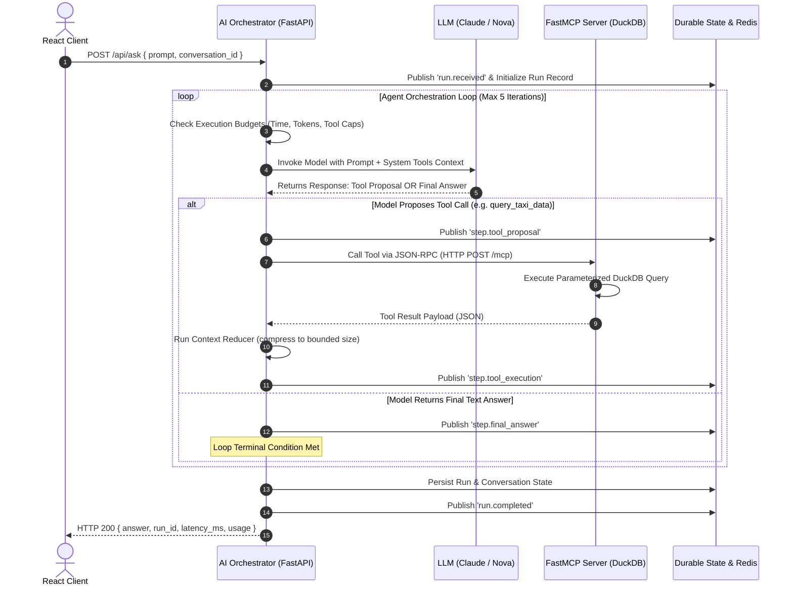

# What Happens When a User Clicks "Run Analysis" in an AI App?
### A Deep-Dive System Design Breakdown of Agent Loops, the Model Context Protocol (MCP), and Event-Driven Telemetry

---

> *In classical computer science, a quintessential interview question is: **"What happens when you type `google.com` into your browser address bar and press Enter?"** It traces DNS resolution, TCP handshakes, TLS negotiation, HTTP multiplexing, DOM rendering, and socket lifecycles.*
> 
> *In the era of Generative AI and Agentic Systems, the modern counterpart is: **"What happens when a user types a prompt into an AI Analytics application and clicks 'Run Analysis'?"***
> 
> *This system design blog deconstructs the full lifecycle of an autonomous, cost-governed AI application — from client interaction and multi-turn agent loops to tool discovery over the Model Context Protocol (MCP), context compression, state hierarchies, and real-time Server-Sent Events (SSE) telemetry.*

*(For the underlying zero-NAT AWS Cloud infrastructure and deployment details, see the root [README.md](https://github.com/NakulManchanda/ai-analytics-poc/blob/main/README.md).)*

---

## 1. High-Level Architectural Anatomy: The Modern AI Stack

A naive AI wrapper simply sends a user prompt directly to an LLM API endpoint and waits for text. In contrast, a **production-grade AI Application** is a distributed, event-driven system divided into distinct trust, compute, and data boundaries:

```
[ User Browser / React SPA ]
             │
             │ 1. POST /api/ask (or /api/jobs)
             │ 2. GET /api/runs/{run_id}/events (SSE Stream)
             ▼
┌─────────────────────────────────────────────────────────────────────────────┐
│  THE AI ORCHESTRATOR ("The Backend of AI")                                  │
│  FastAPI Application Server                                                 │
│                                                                             │
│  ┌───────────────────────┐   ┌───────────────────────┐   ┌───────────────┐  │
│  │ State Repository      │   │ Execution Budgets     │   │ Context       │  │
│  │ (Durable Storage)     │   │ & Guardrails          │   │ Reducer       │  │
│  └───────────────────────┘   └───────────────────────┘   └───────────────┘  │
│                                                                             │
│  ┌───────────────────────────────────────────────────────────────────────┐  │
│  │ Multi-Turn Agent Execution Harness ([loop.py](https://github.com/NakulManchanda/ai-analytics-poc/blob/main/services/app/app/orchestration/loop.py))                      │  │
│  └───────────────┬───────────────────────────────────────┬───────────────┘  │
└──────────────────┼───────────────────────────────────────┼──────────────────┘
                   │                                       │
                   │ Tool Calls over MCP (JSON-RPC)        │ Bedrock / Anthropic / Nova
                   ▼                                       ▼
┌──────────────────────────────────────┐     ┌────────────────────────────────┐
│ ANALYTICAL GATEWAY (FastMCP)         │     │ FRONTIER FOUNDATION MODEL      │
│ [server.py](https://github.com/NakulManchanda/ai-analytics-poc/blob/main/services/mcp/mcp_server/server.py)                            │     │ Claude 3.5 Haiku / Nova Micro  │
│                                      │     └────────────────────────────────┘
│ ┌──────────────────────────────────┐ │
│ │ Read-Only Engine (DuckDB Views)  │ │
│ └──────────────────────────────────┘ │
│ ┌──────────────────────────────────┐ │
│ │ Local Parquet Data (2.96M Trips) │ │
│ └──────────────────────────────────┘ │
└──────────────────────────────────────┘
```

The system is fundamentally decoupled into three core boundaries:
1. **The AI Orchestrator (Brain & Policy Engine)**: Owns LLM interactions, user state, execution budgets, conversation history, and lifecycle telemetry.
2. **The Analytical Gateway (Tool Boundary)**: Exposes strictly allowlisted capabilities over the open **Model Context Protocol (MCP)**.
3. **The Foundation Model Provider**: Provides pure reasoning and natural language synthesis without direct network or database access.

---

## 2. The Core Agent Loop & Reasoning Path

At the center of the AI backend sits the **Agent Loop** ([loop.py](https://github.com/NakulManchanda/ai-analytics-poc/blob/main/services/app/app/orchestration/loop.py)). The orchestrator manages a multi-turn conversation between the model and available tools.



### Reasoning Loop Dynamics:
- **Decision Phase**: In each turn, the model evaluates the current working context and emits either an analytical tool proposal (e.g., `query_taxi_data(analysis="top_pickup_zones", limit=5)`) or a synthesized final natural language response.
- **Execution & Ingestion Phase**: When a tool proposal is emitted, the orchestrator executes the tool in isolation over MCP, feeds the reduced observation back to the model, and iterates until the terminal answer is reached or a budget boundary is triggered.

---

## 3. The Fixed Execution Harness & Stopping Guardrails

A fundamental concept in AI system design is **The Fixed Agent Execution Harness**.

An LLM is inherently non-deterministic, probabilistic, and untrusted. It cannot manage its own execution, guarantee network timeouts, or prevent infinite loops. 

The **Execution Harness** ([loop.py](https://github.com/NakulManchanda/ai-analytics-poc/blob/main/services/app/app/orchestration/loop.py)) is the fixed, deterministic software chassis that safely wraps, drives, and contains the model. The model *never* executes freely — it runs strictly strapped inside this harness, which:
1. **Drives Step Transitions**: Manages the state machine transitions between model turns and tool execution.
2. **Intercepts Tool Requests**: Prevents the model from making direct database connections, routing all calls through the Model Context Protocol (MCP).
3. **Applies Context Reduction**: Sanitizes and limits working context before the next turn.
4. **Enforces Hard Guardrails**: Binds the execution to strict, immutable resource caps.

### The Guardrails Built Into the Harness:

Why doesn't the agent loop indefinitely, burning money and hanging server threads?

Within the harness, **the agent loop is a bounded state machine**. The loop exits immediately upon hitting any of the following stopping criteria defined in [budgets.py](https://github.com/NakulManchanda/ai-analytics-poc/blob/main/services/app/app/orchestration/budgets.py):

| Guardrail Dimension | POC Budget Cap | Why It Matters / System Trade-off |
| :--- | :--- | :--- |
| **Max Iterations** | `5` turns | Prevents circular reasoning or back-and-forth tool looping. |
| **Max Tool Calls** | `3` calls | Restricts total analytical queries per user request. |
| **Wall-Clock Timeout** | `30.0` seconds | Protects HTTP gateway limits (CloudFront / ALB timeouts). |
| **Max Input / Output Tokens** | `20,000` / `4,000` | Hard cap on token billing per single interaction. |
| **Max Tool Result Size** | `8,192` bytes | Prevents huge DB dumps from blowing up model context windows. |
| **Estimated Cost Cap** | `$0.50` USD | Fails-safe if reasoning costs cross financial limits. |

```python
# From services/app/app/orchestration/budgets.py
def check_deadline(self) -> None:
    if self.elapsed_seconds > self.budgets.timeout_seconds:
        raise BudgetExceededError(
            f"Exceeded max execution duration of {self.budgets.timeout_seconds}s",
            {"limit": "timeout_seconds", "current": self.elapsed_seconds},
        )
```

---

## 4. The Context Reducer: Solving Context Window Bloat & Cost Explosions

In simple chat applications, developers often append every message and every raw database output directly into the LLM prompt. In an analytical application, this naive pattern quickly leads to **disaster**:

```
NAIVE APPROACH (Prompt Bloat):
Turn 1: [System Prompt] + [User Prompt 1] + [1,000 Rows Taxi Data (50KB)] + [Assistant Answer 1]
Turn 2: [System Prompt] + [Turn 1 History (55KB)] + [User Prompt 2] + [2,000 Rows Taxi Data (100KB)] ...
==> Exponential token cost ($$$), 20-second latency, and "Lost in the Middle" hallucination!
```

To solve this, the orchestrator implements a deterministic **Context Reducer** ([reducer.py](https://github.com/NakulManchanda/ai-analytics-poc/blob/main/services/app/app/orchestration/reducer.py)) that enforces a strict architectural divergence between **Durable Stored State** and **Ephemeral Working LLM Context**:

```
┌─────────────────────────────────────────────────────────────────────────────┐
│  DURABLE STATE (Database / DynamoDB)                                        │
│  - 100% of Conversation History (All 20+ turns stored permanently)          │
│  - Full, untruncated analytical query results and row sets                  │
└──────────────────────────────────────┬──────────────────────────────────────┘
                                       │
                                       │ Context Reducer (reducer.py)
                                       ▼
┌─────────────────────────────────────────────────────────────────────────────┐
│  BOUNDED WORKING CONTEXT (Sent to LLM)                                      │
│  1. Conversation Summary: 1-line compressed digest of older turns           │
│  2. Sliding Window: Only the last 2 recent turns (up to 4 active messages) │
│  3. Tool Preview: Column headers + 3 sample rows + total count              │
│  4. Artifact Pointer: URI reference (artifact://nyc-taxi/queries/{query_id})│
│  5. Schema Context: Compact dataset profile (184 bytes)                     │
└─────────────────────────────────────────────────────────────────────────────┘
```

### How the Context Reducer Works:

1. **Sliding Conversation Window + Deterministic Summarization**:
   - Instead of sending 20 historical messages, `ContextReducer` keeps only the last `recent_turns_window = 2` turns.
   - Older messages are deterministically folded into a compact single string summary (e.g. `"user: Top zones | assistant: JFK had 153k trips"`) without requiring extra billable LLM calls.
2. **Tool Output Sanitization & Previewing**:
   - When FastMCP returns a database result with thousands of rows, `sanitize_and_preview_tool_result` bounds the output payload to:
     - The column list (`columns`)
     - Total aggregate row count (`row_count = 265`)
     - A 3-row preview snippet (`preview_rows = rows[:3]`)
     - A durable artifact reference (`artifact://nyc-taxi/queries/{query_id}`)
3. **Deterministic & Zero-Latency**:
   - The reducer is written in pure Python. It executes in **<1ms** with **zero additional API calls**, guaranteeing the LLM context never blows past budget limits.

```python
# From services/app/app/orchestration/reducer.py
def sanitize_and_preview_tool_result(
    tool_result: dict[str, Any], max_rows: int = 3
) -> dict[str, Any]:
    """Reduce large tool results to schema + aggregates + preview + artifact ref."""
    rows = tool_result.get("rows", [])
    query_id = str(tool_result.get("query_id", "unknown"))
    return {
        "query_id": query_id,
        "columns": tool_result.get("columns", []),
        "row_count": tool_result.get("row_count", len(rows)),
        "preview_rows": rows[:max_rows] if isinstance(rows, list) else [],
        "artifact_ref": f"artifact://nyc-taxi/queries/{query_id}",
        "execution_duration_ms": tool_result.get("execution_duration_ms", 0),
    }
```

> ⚖️ **The Conscious Architectural Trade-off**: Setting `DEFAULT_RECENT_TURNS_WINDOW = 2` trades verbatim recall of distant turns for guaranteed flat sub-second latency and $O(1)$ token pricing — choosing to re-query cheap analytical views on demand rather than paying for 100,000 carried tokens on every conversational turn.

---

## 5. The Model Context Protocol (MCP) Boundary

A critical architectural tenet of this system is: **The MCP Analytical Server NEVER calls an LLM.**

```
┌──────────────────────────────────────────────────────────┐
│  AI Orchestrator (FastAPI)                               │
│  - Owns Model Invocation & API Keys                      │
│  - Owns Loop Logic & Budget Tracking                     │
│  - Owns User Identity & Durable State                    │
└────────────────────────────┬─────────────────────────────┘
                             │  Model Context Protocol (JSON-RPC over HTTP)
                             ▼
┌──────────────────────────────────────────────────────────┐
│  Analytical Gateway (FastMCP Server)                     │
│  - Zero LLM Knowledge (Never imports Bedrock/OpenAI)     │
│  - Read-Only Analytical Engine (DuckDB)                  │
│  - Strict Input Validation & Schema Discovery            │
└──────────────────────────────────────────────────────────┘
```

### Why This Separation Matters:
1. **Least Privilege & Security**: The MCP server operates as a zero-trust analytical sandbox. Even if the LLM hallucinated malicious SQL, the MCP server does not accept arbitrary SQL strings — it accepts only strongly-typed analytical keys (`analysis="top_pickup_zones"`).
2. **Tool Discovery (`list_tools`)**: On startup, the orchestrator calls `client.list_tools()` over MCP. The orchestrator automatically extracts parameter JSON Schemas and docstrings and converts them into the LLM provider's tool-calling format.
3. **Converting Any Server to an MCP Server**: Any database, REST API, or internal microservice can be exposed to AI agents simply by wrapping functions in `@mcp.tool()` decorators without coupling them to any AI SDK.

```python
# From services/mcp/mcp_server/server.py
@mcp.tool()
def query_taxi_data(
    analysis: AnalysisName,
    limit: int = 5,
) -> dict[str, object]:
    """Execute a governed analytical query over the NYC Yellow Taxi dataset."""
    return run_pinned_query(analysis=analysis, limit=limit)
```

---

## 6. State Hierarchy: Identifiers & Durability

A common point of failure in AI system design is confusing **transient execution events** with **durable conversation history**, or confusing where loop iteration limits are enforced.

```
Conversation (conv_...) ── Continuous Multi-Turn Session (Uncapped Total Questions)
  │                         └── Managed by Context Reducer Sliding Window (Last 2 Turns)
  │
  ├── Run #1 (run_...) ── ENFORCES EXECUTION BUDGET (max_iterations=5, max_tool_calls=3)
  │    ├── Step #1 (step_...) ── Iteration 1: Model Proposes Tool Call (llm_call_id)
  │    ├── Step #2 (step_...) ── Iteration 1: FastMCP Executes DuckDB Query (tool_call_id, query_id)
  │    └── Step #3 (step_...) ── Iteration 2: Model Synthesizes Final Answer (llm_call_id)
  │
  └── Run #2 (run_...) ── FRESH EXECUTION BUDGET (Tracker Resets to 0 for Next Question)
       ├── Step #1 (step_...)
       └── Step #2 (step_...)
```

### The ID Hierarchy & Scope:

- **`conversation_id` (The Multi-Turn Session)**:
  - Spans the entire multi-turn thread between user and assistant across dozens of questions.
  - Has **no hard loop limit**; long-term context is kept bounded via the **Context Reducer's sliding window** (retaining the last 2 turns in active working memory).
- **`run_id` (The Loop Budget Boundary ⭐)**:
  - Spawned afresh each time the user submits a prompt (`POST /api/ask`).
  - **This is the authoritative boundary where the execution harness enforces multi-turn loop limits** (`max_iterations = 5`, `max_tool_calls = 3`, `timeout_seconds = 30.0`). The tool-calling loop executes entirely within the scope of this single run.
- **`step_id` (Atomic Action inside a Run)**:
  - Monotonically identifies an individual action within a run (Model Proposal $\rightarrow$ FastMCP Query $\rightarrow$ Final Answer). The total step count is bounded by the run's `max_iterations` cap.
- **`llm_call_id` & `tool_call_id` / `query_id` (Telemetry Telemetry)**:
  - Correlate individual LLM token telemetry and FastMCP database execution durations with the parent run and step.

### Durable vs. Ephemeral Storage:
- **Durable Store (DynamoDB / PostgreSQL)**: Saves finalized messages, token tallies, run outcomes, and conversation threads. This is authoritative.
- **Transient Store (Redis Streams / In-Memory)**: Coordinates pub/sub event fan-out for real-time SSE streaming. If Redis is rebooted, no conversation history is lost.

---

## 7. Real-Time Telemetry & The Streaming Experience (SSE)

When an AI query executes tool calls against millions of records, processing takes 2–5 seconds. If the frontend simply waits for a single HTTP response, users perceive the interface as frozen.

To deliver a rich, transparent user experience, the system uses **Server-Sent Events (SSE)** ([events.py](https://github.com/NakulManchanda/ai-analytics-poc/blob/main/services/app/app/routers/events.py)).

```
Client connects to: GET /api/runs/{run_id}/events

event: run.received
data: {"event_type": "run.received", "sequence": 1, "payload": {"status": "in_progress"}}

event: step.tool_proposal
data: {"event_type": "step.tool_proposal", "sequence": 2, "payload": {"tool_name": "query_taxi_data", "analysis": "top_pickup_zones"}}

event: step.tool_execution
data: {"event_type": "step.tool_execution", "sequence": 3, "payload": {"query_id": "query_174", "row_count": 5, "duration_ms": 1941}}

event: step.final_answer
data: {"event_type": "step.final_answer", "sequence": 4, "payload": {"status": "completed"}}

event: run.completed
data: {"event_type": "run.completed", "sequence": 5, "payload": {"total_tokens": 963, "estimated_cost_usd": 0.0010, "latency_ms": 4774}}
```

### Why Structured Step Telemetry Beats Raw Token Streaming for Analytics:
In analytical and tool-using systems, streaming raw word deltas (`"Based" ... "on" ... "the"`) is insufficient because the bulk of the time is spent deciding on and running database queries. 

Structured SSE allows the UI ([TimelineInspector.tsx](https://github.com/NakulManchanda/ai-analytics-poc/blob/main/web/src/TimelineInspector.tsx)) to display real-time timeline badges, query durations, working context sizes, and cost meters as the agent reasons.

---

## 8. Synchronous vs. Asynchronous Workflows

Not every AI task belongs in a synchronous HTTP request. The platform implements a dual ingestion path:

```
                  ┌────────────────────────────────────────┐
                  │          USER INTERACTION              │
                  └───────┬────────────────────────┬───────┘
                          │                        │
             Interactive  │                        │ Long-Running / Batch
             Queries      │                        │ Analytical Reports
                          ▼                        ▼
             ┌─────────────────────────┐  ┌─────────────────────────┐
             │ POST /api/ask           │  │ POST /api/jobs          │
             │ (Synchronous HTTP)      │  │ (Asynchronous Queue)    │
             └────────────┬────────────┘  └────────────┬────────────┘
                          │                            │
                          │ Fast In-Line Loop          │ Push Job to Redis Stream
                          ▼                            ▼
             ┌─────────────────────────┐  ┌─────────────────────────┐
             │ HTTP 200 Result         │  │ Background Worker       │
             │ (Inline + SSE Events)   │  │ ([worker.py](https://github.com/NakulManchanda/ai-analytics-poc/blob/main/services/app/app/worker.py))              │
             └─────────────────────────┘  └────────────┬────────────┘
                                                       │
                                                       ▼ Poll / Stream Result
                                          ┌─────────────────────────┐
                                          │ GET /api/jobs/{id}      │
                                          └─────────────────────────┘
```

1. **Synchronous Path (`POST /api/ask`)**: Used for conversational, interactive queries. The request stays open while the loop executes, and events are simultaneously published to the SSE stream.
2. **Asynchronous Path (`POST /api/jobs`)**: Used for heavy aggregations, multi-month reporting, or batch synthesis. The API immediately returns an `HTTP 202 Accepted` with a `job_id`. Background workers ([worker.py](https://github.com/NakulManchanda/ai-analytics-poc/blob/main/services/app/app/worker.py)) consume the queue, execute the agent loop asynchronously, and update durable state upon completion.

---

## 9. Summary of System Design Trade-offs

| Design Decision | Chosen Approach | Alternative Considered | Why We Chose It |
| :--- | :--- | :--- | :--- |
| **Tool Execution** | Fixed FastMCP Views (DuckDB) | Direct Text-to-SQL Execution | Eliminates prompt injection risk and arbitrary database mutations. |
| **Context Management** | Context Reducer with strict byte caps | Appending full raw DB rows | Prevents context bloat and explosive token costs over multi-turn runs. |
| **Agent Guardrails** | Strict `ExecutionBudgets` class | Relying on LLM stop signals alone | Prevents infinite retry loops and runaway cloud inference charges. |
| **Service Boundaries** | Separate FastAPI & FastMCP services | Monolithic single-process app | Isolates model orchestration credentials from data execution engines. |
| **UI Telemetry** | Named Server-Sent Events | Polling REST endpoints | Low latency, zero polling overhead, and instant timeline updates. |

---

## Conclusion: Key Takeaways for AI System Designers

When architecting production AI systems:
1. **Treat the model as an untrusted reasoning engine**, not a backend controller.
2. **Keep tool services (MCP) completely independent of LLM providers**.
3. **Enforce hard execution budgets** in code, not just in system prompts.
4. **Separate durable conversation state from transient telemetry streams**.
5. **Use structured event streams (SSE)** to give users full transparency into the agent's reasoning path.

---

### 📂 Codebase References & Implementation Index
- **Multi-Turn Agent Execution Harness**: [services/app/app/orchestration/loop.py](https://github.com/NakulManchanda/ai-analytics-poc/blob/main/services/app/app/orchestration/loop.py)
- **Execution Budgets & Guardrails**: [services/app/app/orchestration/budgets.py](https://github.com/NakulManchanda/ai-analytics-poc/blob/main/services/app/app/orchestration/budgets.py)
- **Context Reducer**: [services/app/app/orchestration/reducer.py](https://github.com/NakulManchanda/ai-analytics-poc/blob/main/services/app/app/orchestration/reducer.py)
- **FastMCP Analytical Server**: [services/mcp/mcp_server/server.py](https://github.com/NakulManchanda/ai-analytics-poc/blob/main/services/mcp/mcp_server/server.py)
- **SSE Telemetry Streaming Router**: [services/app/app/routers/events.py](https://github.com/NakulManchanda/ai-analytics-poc/blob/main/services/app/app/routers/events.py)
- **Asynchronous Worker**: [services/app/app/worker.py](https://github.com/NakulManchanda/ai-analytics-poc/blob/main/services/app/app/worker.py)
- **Frontend Timeline Inspector**: [web/src/TimelineInspector.tsx](https://github.com/NakulManchanda/ai-analytics-poc/blob/main/web/src/TimelineInspector.tsx)
